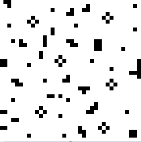

# Ejercicio 3: Búsqueda de patrones simple.

> Si realizas este ejercicio más adelante, es probable que te animes a usar `numpy` + `matplotlib`. Es lo mismo.

El paquete PIL (Python Imaging Library) nos permite manipular y analizar imágenes píxel por pixel.

> Para instalar el paquete debes ejecutar:
> > Windows: `py -m pip install Pillow`
>
> > Linux: `python3 -m pip install Pillow`  

Vamos a aprender algunas cosas sobre el módulo PIL.Image. Con él podemos cargar imagenes para trabajar con ellas:

```python
import PIL.Image
imagen = PIL.Image.open('src/pil_test.bmp') 
# La carpeta src tiene que estar en la misma carpeta que el script.
```

Una vez hecho podemos leer/escribir en píxeles concretos:

```python
pixel = 0,0  # Pixel de la posicion 0,0
imagen.getpixel(pixel) # Leer
imagen.putpixel(pixel, (0,0,0)) # Escribir
```

Y conseguir una matriz con los valores de cada píxel.

```python
matriz = []
for i in range(imagen.width):
    matriz.append([])
    for j in range(imagen.height):
        matriz[i].append(imagen.getpixel((i,j)))
```

Los valores que obtenemos son tuplas con los tres valores enteros de `0` a `255` que se corresponden al nivel de rojo, verde y azul de cada píxel (sistema RGB). El negro se representa con `(0, 0, 0)` y el blanco con `(255,255,255)`.

Una vez que cambiamos los valores con `putpixel`, podemos guardar la imagen:

```python
imagen.save('out.bmp')
imagen.close() # Importante
```

En este ejercicio vamos a buscar patrones simples en pequeñas imágenes. Por ejemplo en siguiente imagen (ampliada):



Podemos encontrar pequeños patrones como este:


1. Encuentra la posición central de todos los patrones que corresponden con el patrón `'patron1.bmp'` en la imagen `'imagen1.bmp'` y muestra las posiciones `(x,y)` por pantalla.
2. Encuentra todos los patrones que corresponden con el patrón `'patron2.bmp'` (solo la cruz azul, ignora el fondo blanco `(255,255,255)`) en la imagen 'imagen2.bmp' y rodealos con un cuadrado rojo `(255,0,0)`. Hablamos solo de los cuadrados de 3x3 que tengan una cruz azul y con el centro y exteriores en cualquier color.
3. Realiza un programa que encuentre cualquier patrón dado por el usuario (máximo 10x10, sin excluir el fondo si tuviera) en cualquier imagen (máximo 2MP) y rodéalos con un cuadrado rojo (si la imagen supera los 0.5MP el cuadrado debe tener 2 píxeles de ancho). Tanto el patrón como la imagen que uses deben de estar guardados en formato .bmp de 24 bits.
4. **[Extra - No Oblig.]** Extiende el programa del apartado 3 para que podamos excluir un color del patrón a la hora de buscar (como hacemos con el blanco en el apartado 2).

Se pueden realizar patrones e imagénes de forma sencilla modificando píxel por píxel con programas como Paint (Windows) o GIMP (Windows, Linux). 