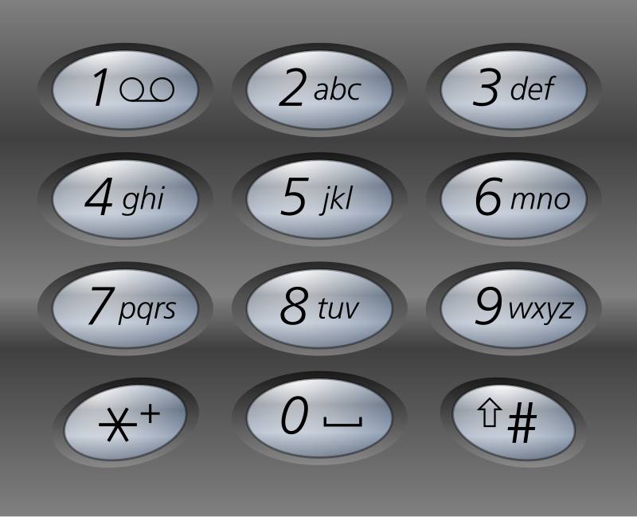

# S4E1: Phonewords.

Cuando usamos el teclado del teléfono móvil para marcar un número el teléfono busca en su agenda resultados que coincidan con el número que estamos escribiendo y, de forma predictiva, nos devuelve el nombre del contacto cuyo teléfono que estamos escribiendo. Además, en algunos modelos, el teléfono nos devuelve también los contactos que coinciden con las *[phonewords](https://es.wikipedia.org/wiki/Phonewords)* del número marcado.

Así por ejemplo al marcar `626` nos tiene que predecir los números que empiezan por `626` y los contactos que empiecen por el equivalente en palabra del `626` como `'Mamá'` (`6=m, 2=a y 6=m`) o `'Manuel'` (`6=m, 2=a, 6=n`). El orden de las predicciones es el siguiente:
1. **El número coincide al principio con el teléfono de un contacto.**
2. **Las *phonewords* que pueda generar el número coincide con alguno de los contactos (por orden alfabético).**
3. **El número está contenido en el número de teléfono del contacto.** Por ejemplo, poner `363` también nos puede predecir el `625363445`.

Realiza un programa que:

1. Devuelva la predicción de un número introducido por pantalla de la agenda del documento `'agenda.json'`.
2. Extiende el programa para que, una vez predecido el teléfono por un número, te permita seguir introduciendo dígitos para afinar la búsqueda y puedas seleccionar la entrada cuando lo desees.
3. Cuando selecciones un número, guarda la hora de la última vez que accediste a él y usa esa fecha como preferencia a la hora de ordenar futuras búsquedas.

Los archivos deben de estar en la misma carpeta que el script. Si quieres guardar la agenda con otro nombre (y leerla posteriormente) simplemente cambia el nombre del archivo en la función `open(...)`.