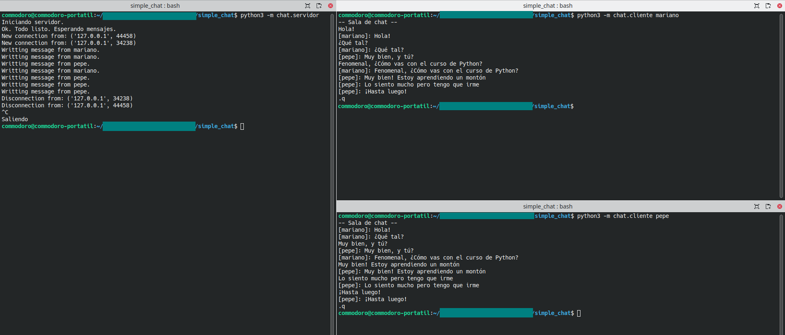

# Ejercicio 7: Chat.  <!-- omit in toc -->

> Este ejercicio tiene parte tutorial, parte ejercicio. Primero se explicará el programa base que dará las bases de sockets necesarias para avanzar en la resolución.

Antes de empezar, clona el siguiente repositorio y abre la carpeta desde Visual Studio Code: https://github.com/commodoro/simple_chat

Los sockets permiten conectar diferentes procesos entre sí. Usando el **protocolo de internet** (**IP** en sus siglas en inglés) podemos incluso conectar procesos en diferentes máquinas. Un ejemplo sencillo de esto sería un programa para chatear.

En el repositorio de ejemplo se encuentra un programa que permite chatear entre usuarios utilizando una arquitectura de cliente-servidor. Es decir, los clientes (usuarios) se conectan a un servidor y este reparte los mensajes entre el resto de clientes conectados (usuarios). 

El programa del servidor está en un subpaquete llamado `chat.servidor` y el de los clientes en `chat.cliente`. Analizaremos el código de ambos paquetes.


- [Servidor](#servidor)
  - [`servidor.servidor`](#servidorservidor)
  - [`servidor.chat`](#servidorchat)
  - [`servidor.__main__`](#servidor__main__)
- [Cliente.](#cliente)
  - [`cliente.cliente`](#clientecliente)
  - [`cliente.interfaz`](#clienteinterfaz)
  - [`cliente.__main__`](#cliente__main__)


## Servidor

El **servidor se encarga de intercambiar mensajes entre los clientes conectados**. Para ello debe cumplir con las siguientes tareas:

- Gestionar las conexiones entrantes.
- Recibir mensajes de los clientes.
- Enviar mensajes a los clientes.
- Cerrar apropiadamente las conexiones de los clientes.

Para realizar estas tareas el paquete cuenta con dos módulos: `servidor` y `chat`. En el primero se gestionan las conexiones y el segundo se realizan el resto de tareas.

### `servidor.servidor`

En el módulo `servidor.servidor` se encuentra la clase `Server` que gestiona las conexiones de socket entrantes en un servidor. La clase se implementa como una subclase de `threading.Thread`, lo que significa que está pensada para ejecutarse en un hilo separado del programa principal.

```python
"""
Contiene la clase `Server` que se encarga de las conexiones.
"""

import select
import threading
import socket

class Server(threading.Thread):
    "Se encarga de gestionar los sockets entrantes"
    
    def __init__(self, *, host: str, port: int, maxbufsize: int = 1024):
        self.host = host
        self.port = port
        self._clients : list[socket.socket] = []
        self._lock = threading.Lock()
        self._end = False
        super().__init__(name="Chat Server")

    @property
    def clients(self) -> list[socket.socket]:
        "Clientes que se han conectado al socket"
        with self._lock:
            return self._clients
        
    @property
    def stop(self) -> bool:
        "`True` para detener la ejecución del programa."
        with self._lock:
            return self._end
        
    @stop.setter
    def stop(self, value: bool) -> None:
        with self._lock:
            self._end = value

    def clear_clients(self):
        "Elimina todas las conexiones."
        with self._lock:
            for client in self._clients:
                client.close()
            self._clients.clear()

    def run(self) -> None:
        "Comprueba el socket del servidor y gestiona las nuevas conexiones."
        with socket.socket(socket.AF_INET, socket.SOCK_STREAM) as s:
            s.bind((self.host, self.port))
            s.listen(0)
            while not self.stop:
                ready: list[socket.socket]
                ready, *_ = select.select((s,),(),(), 1)
                if ready:
                    client, address = ready[0].accept()
                    print("New connection from:", client.getpeername())
                    self.clients.append(client)
            self.clear_clients()
```


El constructor de la clase acepta dos argumentos obligatorios: `host`, `port` y uno opcional: `maxbufsize`. `host` y `port` se utilizan para crear un socket en el servidor y `maxbufsize` se utiliza para especificar el tamaño máximo del búfer para recibir datos. Estos argumentos se guardan en los atributos `self.host`, 

El atributo `self._clients` es una lista que se utiliza para almacenar todas las conexiones entrantes en el servidor. `self._lock` es un objeto de bloqueo (mutex) que se utiliza para asegurarse de que solo un subproceso pueda modificar `self._clients` a la vez. `self._end` es un indicador que se utiliza para detener la ejecución del programa.

Hay tres métodos seguros (que utilizan el bloqueo `self._lock`) en la clase `Server`. 

- **`clients`**: es una propieda que devuelve la lista de clientes `_clients`. 
- **`stop`**: es una propiedad permite acceder y modificar `_end`, lo que precipita el final del hilo.
- **`clear_clients`**: es un método que se utiliza para cerrar todas las conexiones con los clientes.

El método `run` es el método principal que se ejecuta cuando el hilo se inicia. Dentro de este método, se crea un objeto de `socket` y se vincula al `host` y `port` especificados. A continuación, se llama a `listen` para comenzar a aceptar conexiones entrantes (con 0 quiere decir que acepta un número ilimitado). Se utiliza `select` para esperar una nueva conexión durante un segundo, y si hay una conexión entrante, se acepta y se agrega a la lista de clientes. El bucle se repite hasta que `stop` es `True`.

La función `select.select` es una función de alto nivel en Python que permite monitorear múltiples sockets (tanto de lectura como de escritura) para determinar si hay datos disponibles para leer o si se pueden escribir datos en el socket. Esta función es muy útil para programar servidores que atienden múltiples clientes simultáneamente, ya que evita la necesidad de crear un proceso o hilo separado para cada cliente.

```python
import select

ready_to_read, ready_to_write, has_error = select.select(readable, writable, error[, timeout])
```

`select.select` toma tres listas de sockets como argumentos: `readable`, `writable` y `error`. Cada una de estas listas contiene los sockets que se están monitoreando para determinar si se puede leer o escribir en ellos o si se ha producido algún error. La función devuelve tres listas: `ready_to_read`, `ready_to_write` y `has_error`. Cada una de estas listas contiene los sockets que están listos para ser leídos, escritos o que han experimentado un error, respectivamente. 

El argumento opcional `timeout` especifica un tiempo de espera como un número de punto flotante en segundos. Cuando se omite el argumento `timeout`, la función se bloquea hasta que al menos un descriptor de archivo esté listo. Un valor de tiempo de espera de cero especifica un sondeo y nunca se bloquea.

En el código proporcionado, `select.select` se utiliza para monitorear el socket del servidor para determinar si hay nuevas conexiones entrantes en el servidor. El primer argumento de `select.select` es una tupla que contiene solo el socket del servidor que se está monitoreando para determinar si hay nuevas conexiones entrantes. Aunque solo haya un socket, **utilizamos `select.select` porque de esta manera evitamos el bloqueo que produce `socket.accept()`** y podemos monitorizar en el mismo hilo si el hilo debe finalizar (`self.stop == True`).

> En este ejercicio se utiliza `select.select()` de forma intensiva.

### `servidor.chat`

En este módulo se gestionan los mensajes del chat.

```python
"""
En este módulo se intercambian los mensajes en el chat.
"""

from dataclasses import dataclass
import select
import socket
import threading
from typing import Sequence
from . import servidor
import json

seqsockets = Sequence[socket.socket]

class ChatFormatError(Exception):
    "Representa un error en el formato de intercambio de mensajes."
    def __init__(self, msg: str, payload: bytes|str) -> None:
        self.msg = msg
        self.payload = payload
        super().__init__(self.msg)


@dataclass
class ChatMessage:
    "Encapsula un mensaje."
    user: str
    message: str

    @classmethod
    def from_json(cls, msg: bytes|str) -> "ChatMessage":
        try:
            data = json.loads(msg)
            user = data['user']
            message = data['message']
            assert isinstance(user, str)
            assert isinstance(message, str)
        except (ValueError, KeyError, AssertionError):  # Agrupación de errores
            raise ChatFormatError('Error with the format. Must be a json with the fields "user" and "message". Recommended encoding: utf-8.', msg)
        return cls(user, message)
    
    @property
    def json(self) -> str:
        "Devuelve una cadena en formato json con los datos de la clase."
        return json.dumps({'user': self.user, 'message': self.message})


class Chat(threading.Thread):
    "A partir del servidor gestiona las entradas y salidas del chat."

    def __init__(self, server: servidor.Server, maxbufsize: int = 1024):
        self.server = server
        self._lock = threading.Lock()
        self._end = False
        self._BUFSIZE = maxbufsize
        super().__init__(name='chat')

    @property
    def BUFSIZE(self) -> int:
        "Representa el tamaño máximo del mensaje que puede recibir."
        return self._BUFSIZE

    @property
    def stop(self) -> bool:
        "`True` para detener la ejecución del programa."
        with self._lock:
            return self._end
        
    @stop.setter
    def stop(self, value: bool) -> None:
        with self._lock:
            self._end = value

    def run(self):
        "Actividad del chat."
        assert self.server.is_alive(), "Server must be running before start."
        while not self.stop:
            messages: list[ChatMessage] = []
            r: seqsockets; w: seqsockets; a: seqsockets
            r, w, a = select.select(self.server.clients, self.server.clients, self.server.clients, 1)

            for readable in r:
                data = readable.recv(self.BUFSIZE)
                if data:  # Ver (1)
                    try:
                        message = ChatMessage.from_json(data)
                        messages.append(message)
                    except ChatFormatError:
                        message = ChatMessage('ServerInfo', "Format Error")
                        messages.append(message)
                else:
                    print("Disconnection from:", readable.getpeername())
                    self.server.clients.remove(readable)
                    readable.close()

            for message in messages:
                print(f"Writting message from {message.user}.")
                for writable in w:
                    writable.sendall(message.json.encode())

            for problem in a:
                print("Disconnection from:", problem.getpeername(), "due a problem.")
                self.server.clients.remove(problem)
                problem.close()
            
            if not self.server.is_alive():
                self.stop = True
```

La clase `Chat` es la encargada de gestionar las entradas y salidas del chat. Es una subclase de `threading.Thread`, lo que significa está pensada para ejecutarse como un hilo de manera concurrente al resto del programa. Esta clase se encarga de recibir y enviar mensajes a través del socket que maneja el servidor.

El constructor de la clase `Chat` recibe una instancia de la clase `Server` que representa el servidor de chat al que se va a conectar. Además, puede recibir opcionalmente un argumento `maxbufsize`, que determina el tamaño máximo del mensaje que se recibe.

La clase `Chat` tiene dos atributos privados `_lock` y `_end`, que son utilizados para controlar la ejecución del hilo como en la clase `servidor.Server`. También tiene un atributo `_BUFSIZE` que representa el tamaño máximo del mensaje que se puede recibir.

El método `run()` representa la actividad principal del hilo. Se ejecuta en un bucle infinito mientras el valor de la propiedad `stop` es `False`. Dentro del bucle, **la función `select.select()` se utiliza para implementar un modelo de entrada-salida (I/O) no bloqueante**. Específicamente se verifican los sockets abiertos por el servidor para determinar cuáles tienen datos listos para ser leídos y cuáles pueden aceptar nuevos datos para escribir.  

En caso de haber nuevos mensajes, se procesan y se envían a todos los clientes conectados. Si se produce una desconexión, se elimina al cliente de la lista de clientes conectados.

> `(1)`: Cuando se desconecta un socket se envía un mensaje nulo al otro lado. Al comprobar la entrada podemos detectar si el cliente ha finalizado la conexión. 

La clase `ChatMessage` es una clase de datos que encapsula un mensaje y tiene dos campos, `user` y `message`, que representan el nombre del usario que ha escrito el mensaje y el propio mensaje respectivamente. Tiene dos métodos, uno que convierte una cadena en formato JSON a un objeto `ChatMessage`, y otro que convierte un objeto `ChatMessage` a formato JSON.

El módulo también cuenta con la excepción `ChatFormatError`, que es lanzada cuando se produce un error en el formato del mensaje que se recibe. Esto sucede cuando el mensaje recibido no cumple con el formato esperado, que debe ser un objeto JSON con los campos user y message. Esta excepción es útil para informar a los clientes que se produjo un error en el envío de un mensaje.

### `servidor.__main__`

El programa principal recoge los argumentos pasados por línea de comando e inicia los hilos.

El parser de argumentos de línea de comando utiliza argparse para permitir al usuario especificar si el servidor es solo local o no y en qué puerto se desea que el servidor se ejecute. Si no se especifica ningún puerto, por defecto, el servidor utilizará el puerto `51000`.

En la función principal se crean las instancias de `Server` y `Chat` usando los argumentos pasador al parser y se inicia cada hilo con sus respectivos métodos `start()`. Se imprime un mensaje para informar al usuario que el servidor se ha iniciado correctamente y se está esperando mensajes y el programa queda a la espera de que acaben los hilos.

> Para manejar la señal de interrupción (`SIGINT`) que se produce cuando el usuario presiona `Ctrl + C` para detener el servidor, se define una función `_stop` que detendrá el servidor y el chat. Esta función se asigna a la señal `SIGINT` utilizando la función `signal.signal()`.

Para precipitar la finalización de los hilos usamos `Ctrl + C`. Para ejecutar el programa, desde la carpeta del repositorio, ejecutamos:

```
python3 -m chat.servidor  # En Linux/MacOS
py -m chat.servidor  # En windows
```

Puedes ver las opciones disponibles agregando `--help` al comando.

## Cliente.

El paquete de **cliente hace de interfaz con el usuario**. Cumple con los siguientes roles:

- Conecta con el servidor donde está el chat.
- Recibe mensajes del servidor de otros clientes.
- Envía mensajes al servidor.

Para realizar estas tareas el paquete cuenta con dos módulos: `cliente` e `interfaz`. En el primero se gestiona la conexión e intercambio de mensajes con el servidor y el segundo se encarga de mostrar y leer mensajes del usuario. 

### `cliente.cliente`

En este módulo se encuentra la clase `Client` que se encarga de la conexión en intercambio de mensajes con el servidor. La clase deriva de `threading.Thread`, lo que significa que se ejecutará en un hilo separado al llamar al método `start()`.

```python
"""
Define la clase Cliente que gesiona las conexiones con el servidor.
"""

import select
import socket
import threading
import queue

class Client(threading.Thread):
    "Gestiona la conexión con el servidor."

    def __init__(self, *, host: str, port: int, maxbufsize = 1024):
        self.host = host
        self.port = port
        self.input_queue = queue.Queue()
        self.output_queue = queue.Queue()
        self._lock = threading.Lock()
        self._end = False
        self._BUFSIZE = maxbufsize
        super().__init__(name="chat_client")

    @property
    def BUFSIZE(self) -> int:
        "Representa el tamaño máximo del mensaje que puede recibir."
        return self._BUFSIZE

    @property
    def stop(self) -> bool:
        "`True` para detener la ejecución del programa."
        with self._lock:
            return self._end
        
    @stop.setter
    def stop(self, value: bool) -> None:
        with self._lock:
            self._end = value

    def run(self):
        "Escanea la conexión en busca de nuevos mensajes y escribe los mensajes de la cola."
        with socket.socket(socket.AF_INET, socket.SOCK_STREAM) as conn:
            conn.connect((self.host, self.port))
            while not self.stop:
                ready : list[socket.socket]
                ready, *_ = select.select((conn,), (), (), 0.2)
                if ready:
                    raw_data = ready[0].recv(self.BUFSIZE)
                    if raw_data:
                        self.input_queue.put(raw_data)
                    else:
                        print('¡Servidor desconectado!')
                        self.stop = True
                        continue
                try:
                    output_data = self.output_queue.get_nowait()
                except queue.Empty:
                    continue
                conn.sendall(output_data)
```

En el constructor de `Client` se recibe el `host` (dirección IP) y `puerto` del servidor, así como un parámetro opcional `maxbufsize` que representa el tamaño máximo del mensaje que puede recibir.

En el método `run()`, se realiza la conexión con el servidor y escanea la conexión en busca de nuevos mensajes. Si hay algún mensaje nuevo, se agrega a la cola de entrada `input_queue`. Si la cola de salida `output_queue` tiene algún mensaje, se envía al servidor.

En resumen, esta clase se encarga de manejar la comunicación entre el cliente y el servidor en dos colas separadas. Cada vez que el usuario recibe un mensaje del servidor, se agrega a la cola de entrada (`input_queue`) para que pueda ser procesado. Del mismo modo, cada vez que el usuario quiere enviar un mensaje al servidor, solo tiene que agregarlo a la cola de salida (`output_queue`) para ser enviado.


### `cliente.interfaz`

En el módulo interfaz se encuentra definida la interacción con el usuario.

```python
"""
Este módulo se encarga de gestionar los mensajes y mostrarlos por pantalla. También recoge los datos desde la terminal..
"""

from dataclasses import dataclass
import json
from queue import Empty
import threading
from . import cliente

class ChatFormatError(Exception):
    "Representa un error en el formato de intercambio de mensajes."
    def __init__(self, msg: str, payload: bytes|str) -> None:
        self.msg = msg
        self.payload = payload
        super().__init__(self.msg)

@dataclass
class ChatMessage:
    "Encapsula un mensaje."
    user: str
    message: str

    @classmethod
    def from_json(cls, msg: bytes|str) -> "ChatMessage":
        try:
            data = json.loads(msg)
            user = data['user']
            message = data['message']
            assert isinstance(user, str)
            assert isinstance(message, str)
        except (ValueError, KeyError, AssertionError):  # Agrupación de errores
            raise ChatFormatError('Error with the format. Must be a json with the fields "user" and "message". Recommended encoding: utf-8.', msg)
        return cls(user, message)

    @property
    def json(self) -> str:
        "Devuelve una cadena en formato json con los datos de la clase."
        return json.dumps({'user': self.user, 'message': self.message})
    
    @property
    def display(self) -> str:
        "Devuelve como se muestra el mensaje en la terminal."
        return f'[{self.user}]: {self.message}'


class ChatInterface(threading.Thread):
    "Interfaz del chat"

    def __init__(self, client: cliente.Client, username: str):
        self.client = client
        self._end = False
        self._lock = threading.Lock()
        self.user = username
        super().__init__(name='chat_interface')
        
    @property
    def stop(self) -> bool:
        "`True` para detener la ejecución del programa."
        with self._lock:
            return self._end
        
    @stop.setter
    def stop(self, value: bool) -> None:
        with self._lock:
            self._end = value


    def input_method(self):
        "Hilo que captura la entrada desde la terminal."
        while not self.stop:
            entry = input()
            if entry == '.q':
                self.stop = True
                self.client.stop = True
            else:
                message = ChatMessage(self.user, entry)
                self.client.output_queue.put(message.json.encode())

    def run(self):
        "Muestra y recibe los mensajes desde la terminal."

        input_thread = threading.Thread(target=self.input_method, name='input_method')
        input_thread.start()
        while not self.stop:
            try:
                data = self.client.input_queue.get(timeout=0.2)
                message = ChatMessage.from_json(data)
            except Empty:
                if not self.client.is_alive():
                    self.stop = True
                    print('Se ha producido un error. Pulsa enter para salir.')
                continue
            except ChatFormatError:
                print("SysInfo - Bad message from the server")
            else:
                print(message.display)
        input_thread.join()
```

> `ChatFormatError` y `ChatMessage` son semejantes a las definidas en el servidor. `ChatMessage` tiene una propiedad adicional para mostrar el mensaje.

`ChatInterface` es la clase que se encarga de gestionar la interacción del usuario con el chat y mostrar los mensajes en la pantalla. La clase está diseñada como un hilo.

Para crear una instancia de `ChatInterface`, se necesita proporcionar un objeto `Client` y el nombre de usuario que se usará en el chat.

La clase tiene dos métodos principales, `input_method()` y `run()`. El primero se encarga de capturar la entrada de la terminal del usuario y enviarla al servidor a través de la cola de salida del cliente. El segundo es el método principal que se ejecutará en el hilo y se encargará de mostrar los mensajes recibidos en el servidor.

Dentro de `run()`, se crea un hilo adicional para `input_method()` que captura la entrada del usuario. En este hilo se ejecuta un bucle infinito hasta que se recibe un mensaje especial (la cadena `".q"`), momento en el que se establece `self.stop` en `True` y se para este hilo y el principal.

Mientras tanto, el hilo principal espera a que se reciban nuevos mensajes del servidor en la cola de entrada del cliente. Si se recibe un mensaje, se convierte a un objeto `ChatMessage` utilizando el método de clase `from_json` de la clase `ChatMessage` y se muestra en la pantalla utilizando la propiedad `display`. Si no se recibe ningún mensaje tras un corto periodo de tiempo, se lanza la excepción `Empty` y se comprueba que el cliente (`self.client`) sigue conectado antes de volver a comprobar si hay nuevos mensajes. Si el hilo del cliente ha terminado, se establece la propiedad `stop` en `True` y se imprime un mensaje de salida en la pantalla para detener el hilo de `ìnput_method()`.

> Para detener apropiadamente el hilo de `input_method` se debe pulsar `Enter` para salir del bloqueo producido en `input()`.

Si se produce un error al recibir un mensaje, por ejemplo, porque el mensaje recibido no tiene el formato correcto, se captura la excepción `ChatFormatError` y se muestra un mensaje de error en la pantalla. 


### `cliente.__main__`

Este es el módulo principal que contiene la función `main()`. 

Primero, se utiliza el módulo `argparse` para parsear los argumentos de la línea de comandos, que son el nombre de usuario, la dirección IP del servidor y el puerto del servidor. Luego se crea una instancia de la clase `cliente.Client` y otra instancia de la clase `interfaz.ChatInterface`, pasando el objeto `client` y el nombre de usuario como argumentos a la clase `ChatInterface`.

Se inician ambos procesos con `client.start()` e `interface.start()`. Luego se define una función `_stop` para manejar la señal `SIGINT` (producida cuando se presiona Ctrl-C para detener el cliente). Esta función establece la propiedad `stop` en `True` para ambas instancias de `client` e `interface`, y muestra un mensaje al usuario para informar que el programa se está deteniendo (a la espera de pulsar `Enter`).

Finalmente, se registra la señal `SIGINT` con la función `singal.signal()` y se llama a `client.join()` e `interface.join()` para esperar a que ambos procesos terminen. Si ambos procesos han terminado, el programa finaliza.

Para ejecutar el programa, desde la carpeta del repositorio, ejecutamos:

```
python3 -m chat.cliente nombre_usuario # En Linux/MacOS
py -m chat.cliente nombre_usuario # En windows
```

Puedes ver las opciones disponibles agregando `--help` al comando.

## Ejemplo de uso: <!-- omit in toc -->



## Enunciado <!-- omit in toc -->

La aplicación es muy sencilla, realiza los siguientes cambios:

1. Modifica los programas para añadir un sistema de usuarios.
   -  Cuando se realice la conexión, el servidor esperará unos segundos a que el cliente le pase información sobre el usuario (alias).
   -  Si no le ha pasado información en el tiempo definido la conexión será rechazada. También se rechazará si ya existe un usuario con ese nombre en el chat. Muestra un mensaje de error si así sucede.
   -  Si la información es correcta el usuario entrará al chat y se mostrará un mensaje en el chat de que el usuario ha ingresado.
   -  Cuando el usuario se desconecte se mostrará un mensaje de que se ha desconectado.
   -  Se debe comprobar que el usuario que aparece en el mensaje que envía un usuario corresponde, efectivamente, al usuario que realizó esa conexión.
   -  Cuando se introduzca `'.l'` en el chat, se debe imprimir por pantalla una lista de usuarios conectados al chat. 
2. Modifica los programas para añadir la fecha y hora junto al nombre del usuario en cada mensaje (usa el módulo `time`). Esta opción se activará si el usuario introduce `'.t'` en el chat. También puede desactivarla con el mismo comando.
3. Modifica los programas para guardar en un archivo los mensajes del chat (ignora las entradas). Esta opción se activa y desactiva con `'.r'`. El archivo de salida tendrá de nombre `record_chat_[fecha y hora].txt` donde `fecha y hora` corresponde al momento donde se empezó a grabar el chat.
   - Puedes hacer que guarde todo el historial del chat (tendrías que guardarlo) o solo a partir de activar `'.r'`. Te lo dejo a tu criterio.
4. Añade un comando más, `.h`, que imprima lo que hacen los demás comandos: `.q`, `.r`, `.t` y `.l`.
5. [OPCIONAL] Usando el módulo `tkinter`, crea una interfaz grafica sencilla (un cuadro de texto con scroll y una entrada) para el cliente del chat.

Ejemplo de interfaz con `tkinter`.

