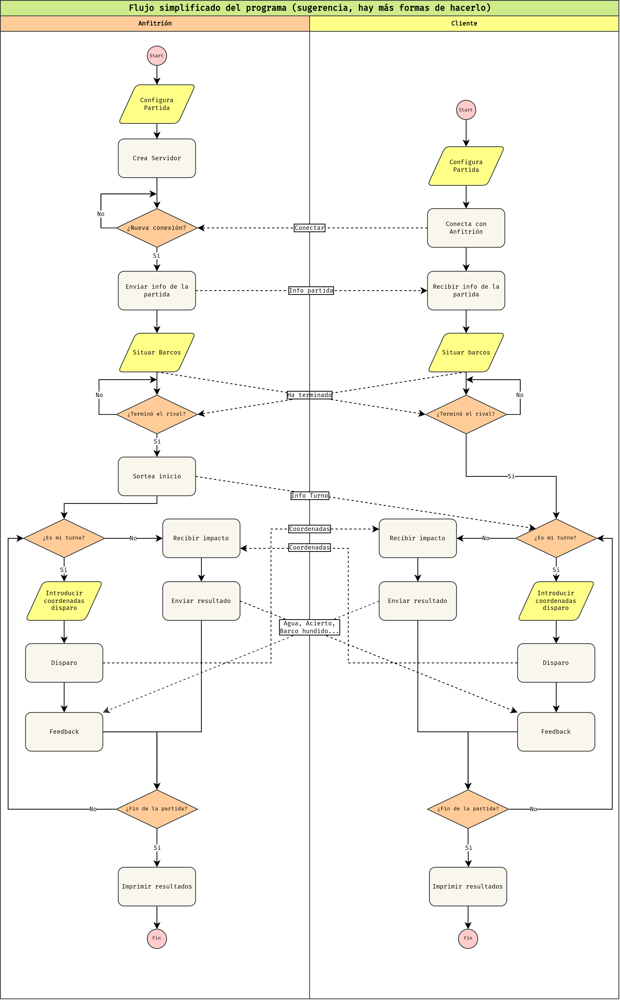
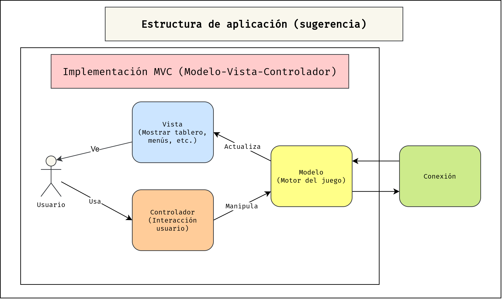

# Ejercicio 8: Juego Online.  <!-- omit in toc -->

- [Enunciado](#enunciado)
- [Ejemplo de interfaz en terminal.](#ejemplo-de-interfaz-en-terminal)
  - [Fase de colocar barcos.](#fase-de-colocar-barcos)
  - [Fase de juego.](#fase-de-juego)
    - [Turno jugador.](#turno-jugador)
    - [Turno contrincante.](#turno-contrincante)
- [Notas sobre implementación.](#notas-sobre-implementación)
  - [Flujo del programa.](#flujo-del-programa)
  - [Estructura de aplicación: patrones de diseño.](#estructura-de-aplicación-patrones-de-diseño)


## Enunciado

Realiza la implementación del juego de [hundir la flota](https://es.wikipedia.org/wiki/Batalla_naval_(juego)) con las siguientes reglas:

- Los buques disponibles para usar son:
  - Portaviones (5 espacios).
  - Acorazado (4 espacios).
  - Crucero (3 espacios).
  - Destructor (2 espacios).
- Cada partida contará con 1 portaviones, 1 acorazado, 2 cruceros y 2 destructores.
- Cada usuario tiene 50 disparos. El juego termina cuando se hunde alguna flota o cuando ambos jugadores superan el límite de disparos, en cuyo caso gana el que más barcos ha hundido.
- El tablero será de 10x10. Puedes nombrar con letras las filas, las columnas o ambas.

El juego se debe poder jugar en red. Usa `sockets` TCP para la comunicación entre equipos. 

**AMPLIACIÓN.** Si te ves con buen nivel:
- Añade un temporizador por turno.
- Añade la opción de editar la configuración del juego (tamaño del tablero, número y tipos de barcos, número de disparos, etc.) antes de jugar.
- **Nivel difícil.** Utiliza una interfaz gráfica usando la librería `tkinter` (GUI genéricas) o `pygame` (librería para juegos sencillos).
- **Nivel Extremo.** Diseña la aplicación de modo que un servidor esté pendiente de la llegada de clientes y los coloque en una cola de espera. Una vez que haya dos clientes en la cola, el servidor debe emparejarlos y establecer una conexión directa punto a punto (`socket`).

> **Nota**: debes intentar realizar el juego de hundir la flota. Pero si no te ves capaz no importa, implementa otro juego más sencillo con el **4 en línea**, el **3 en línea**, ***tutti-frutti***, etc. Lo importante es que sepas gestionar una conexión y orquestes correctamente el intercambio de información.

## Ejemplo de interfaz en terminal.

Para la realizar la interfaz puedes usar la terminal. Un ejemplo de interfaz en la terminal es:

### Fase de colocar barcos.

```
##############################
#### Fase Colocar Barcos #####
##############################

  JUGADOR       CONTRINCANTE
╔ABCDEFGHIJ╗    ╔ABCDEFGHIJ╗
A~~~~█████~║    A~~~~~~~~~~║
B~~~~~~~~~~║    B~~~~~~~~~~║
C~~~~~~~~~~║    C~~~~~~~~~~║
D~~~~~~~~~~║    D~~~~~~~~~~║
E~~~~~~~~~~║    E~~~~~~~~~~║
F~~~~~~~~~~║    F~~~~~~~~~~║
G~~~~~~~~~~║    G~~~~~~~~~~║
H~~~~~~~~~~║    H~~~~~~~~~~║
I~~~~~~~~~~║    I~~~~~~~~~~║
J~~~~~~~~~~║    J~~~~~~~~~~║
╚══════════╝    ╚══════════╝

   Carrier: 5 módulos.
-> Battleship: 4 módulos.
   Cruiser: 3 módulos.
   Cruiser: 3 módulos.
   Destroyer: 2 módulos.

Fila: C
Columna: D
H/V: V
```

Tras pulsar `enter`:

```
##############################
#### Fase Colocar Barcos #####
##############################

  JUGADOR       CONTRINCANTE
╔ABCDEFGHIJ╗    ╔ABCDEFGHIJ╗
A~~~~█████~║    A~~~~~~~~~~║
B~~~~~~~~~~║    B~~~~~~~~~~║
C~~~█~~~~~~║    C~~~~~~~~~~║
D~~~█~~~~~~║    D~~~~~~~~~~║
E~~~█~~~~~~║    E~~~~~~~~~~║
F~~~█~~~~~~║    F~~~~~~~~~~║
G~~~~~~~~~~║    G~~~~~~~~~~║
H~~~~~~~~~~║    H~~~~~~~~~~║
I~~~~~~~~~~║    I~~~~~~~~~~║
J~~~~~~~~~~║    J~~~~~~~~~~║
╚══════════╝    ╚══════════╝

   Carrier: 5 módulos.
   Battleship: 4 módulos.
-> Cruiser: 3 módulos.
   Cruiser: 3 módulos.
   Destroyer: 2 módulos.

Fila: 
```

### Fase de juego.

#### Turno jugador.

```
##############################
######### Fase Juego #########
##############################

  JUGADOR       CONTRINCANTE
╔ABCDEFGHIJ╗    ╔ABCDEFGHIJ╗
A~~~~█████~║    A~~~~~~~~~~║
B~~~~~~~~~~║    B~~~~~~~~~~║
C~~~█~~~~~~║    C~~~~~~~~~~║
D~~~█~~~~~~║    D~~~~~~~~~~║
E~~~█~~██~~║    E~~~~~~~~~~║
F~~~█~~~~~~║    F~~~~~~~~~~║
G~~~~~~~~~~║    G~~~~~~~~~~║
H█~~~~~~~~~║    H~~~~~~~~~~║
I█~~~~███~~║    I~~~~~~~~~~║
J█~~~~~~~~~║    J~~~~~~~~~~║
╚══════════╝    ╚══════════╝

Turno 1/50
Fila: D
Columna: B
```
Tras pulsar `Enter`:

```
##############################
######### Fase Juego #########
##############################

  JUGADOR       CONTRINCANTE
╔ABCDEFGHIJ╗    ╔ABCDEFGHIJ╗
A~~~~█████~║    A~~~~~~~~~~║
B~~~~~~~~~~║    B~~~~~~~~~~║
C~~~█~~~~~~║    C~~~~~~~~~~║
D~~~█~~~~~~║    D~o~~~~~~~~║
E~~~█~~██~~║    E~~~~~~~~~~║
F~~~█~~~~~~║    F~~~~~~~~~~║
G~~~~~~~~~~║    G~~~~~~~~~~║
H█~~~~~~~~~║    H~~~~~~~~~~║
I█~~~~███~~║    I~~~~~~~~~~║
J█~~~~~~~~~║    J~~~~~~~~~~║
╚══════════╝    ╚══════════╝

Turno 1/50
¡Agua! Pulsa enter para continuar.
```
#### Turno contrincante.

```
##############################
######### Fase Juego #########
##############################

  JUGADOR       CONTRINCANTE
╔ABCDEFGHIJ╗    ╔ABCDEFGHIJ╗
A~~~oXX███~║    A~~~~~o~~~~║
B~~~~~~~~~~║    B~~~~~~~~~~║
C~~~█~~~~~~║    C~~~~~~~~~~║
D~~~█~~~~~~║    D~o~~~~~~~~║
E~~~█~~██~~║    E~~~~~o~~~~║
F~~~█~~~~~~║    F~~~~~~~~~~║
G~~~~~~~~~~║    G~~~~~~~~~~║
H█~~~~~~~~~║    H~~~~~~~~~~║
I█~~~~███~~║    I~~~~~~~~~~║
J█~~~~~~~~~║    J~~~~~~~~~~║
╚══════════╝    ╚══════════╝

Turno 3/50.
Esperando al rival...
```

Cuando el rivar realiza el disparo:

```
##############################
######### Fase Juego #########
##############################

  JUGADOR       CONTRINCANTE
╔ABCDEFGHIJ╗    ╔ABCDEFGHIJ╗
A~~~oXX███~║    A~~~~~o~~~~║
B~~~~~~~~~~║    B~~~~~~~~~~║
C~~~█~~~~~~║    C~~~~~~~~~~║
D~~~█~~~~~~║    D~o~~~~~~~~║
E~~~█~~██~~║    E~~~~~o~~~~║
F~~~█~~~~~~║    F~~~~~~~~~~║
G~~~~~~~~~~║    G~~~~~~~~~~║
H█~~~~~~~~~║    H~~~~~~~~~~║
I█~~~~███~~║    I~~~~~~~~~~║
J█~~~~~~~~~║    J~~~~~~~~~~║
╚══════════╝    ╚══════════╝

Turno 3/50.
¡Recibiste un impacto en tu poortaviones [A,F]!
Pulsa enter para continuar.
```

## Notas sobre implementación.

Aunque la implementación del juego es relativamente simple, es posible que cometamos errores de diseño debido a nuestra falta de experiencia. Estos errores pueden convertir un problema aparentemente trivial en un escenario complicado. Para prevenir esto, como diseñadores, debemos definir de manera adecuada el flujo del programa y la forma en que se deben dividir sus diferentes componentes.

### Flujo del programa.

Crear un flujograma antes de empezar a escribir código es una buena práctica en la programación, ya que permite visualizar de forma clara y ordenada el proceso que se desea implementar. Al definir y diseñar el flujo del programa en un diagrama, es posible identificar posibles errores de lógica, detectar posibles cuellos de botella o puntos de fallo en el proceso y planificar una estrategia de resolución de problemas antes de empezar a escribir código.

Además, un flujograma ayuda a establecer la estructura y el orden de los pasos necesarios para completar una tarea o función específica en el programa. Esto ayuda a mantener una organización clara y coherente en el código, lo que facilita la lectura, el mantenimiento y la depuración del mismo.

Una versión simplificada de un flujograma para nuestra aplicación es:



Puedes seguir este esquema **o implementar el tuyo**. Otra opción podría ser que hubiera un servidor que sirviera como intercambiador de información entre los clientes. Incluso dentro de esa implementación, este podría tener más o menos responsabilidad en el juego. **La elección de la mejor opción de implementación depende de ti y de lo que consideres más conveniente.**

### Estructura de aplicación: patrones de diseño.

A la hora de estructurar las aplicación, es recomendable estudiar si algún [**patrón de diseño**](https://es.wikipedia.org/wiki/Patr%C3%B3n_de_dise%C3%B1o) se ajusta a nuestro problema.

Los **patrones de diseño** son soluciones probadas y efectivas para problemas comunes en el desarrollo de software. Estos patrones son soluciones generales que pueden adaptar a diferentes situaciones para lograr resultados óptimos sin reinventar la rueda. 

Al seguir patrones de diseño bien establecidos, se puede lograr una mayor calidad del software, ya que estos patrones han sido ampliamente probados y validados por la comunidad de desarrollo de software.

Conocer patrones de diseño es muy útil en la etapa de planificación y diseño de un programa, ya que permite estructurar y organizar de manera efectiva el código y la lógica de la aplicación. Al aplicar patrones de diseño en el diseño de la arquitectura de un programa permite planificar mejor el desarrollo, identificar los componentes clave de la aplicación y establecer las relaciones entre ellos.

Un patrón de diseño bien conocido y que puede ser útil en nuestro caso es el patrón de **Modelo-Vista-Controlador**, muy utilizado en el **diseño de interfaces**.

El patrón de diseño **Modelo-Vista-Controlador (MVC)** es una arquitectura que separa la interfaz visible de la lógica de una aplicación. La idea principal detrás del patrón MVC es dividir la aplicación en tres componentes principales:

- **Modelo**: Es el componente que maneja los datos y la lógica de la aplicación. Representa el estado y comportamiento del programa y proporciona puntos de acceso (funciones, métodos) para que otros componentes interactúen con él.

- **Vista**: Es el componente que se encarga de presentar la información al usuario final. Muestra los datos al usuario de una manera comprensible y amigable.

- **Controlador**: Es el componente que actúa como intermediario entre la vista y el modelo. Recibe las entradas del usuario, las procesa y actualiza el modelo correspondiente.

La separación de la visualización y la lógica del programa en diferentes componentes permite flexibilidad y escalabilidad de la aplicación, así como la modificación y el mantenimiento del código, ya que cada componente tiene una **responsabilidad** claramente definida y se puede cambiar sin afectar a los demás.

En nuestro caso concreto podemos dividir nuestro programa en 4 componentes:

- **Motor de juego**. Contiene los datos de la partida y posee funciones/métodos para modificar la partida. Dependiendo del diseño este será omnisciente (sabe los datos de ambos jugadores) u limitado (solo conoce los de su jugador). Correspondería al **Modelo** en el patrón MVC.

- **Interfaz**. Se encarga de mostrar los datos, gráficos, menús, etc. por pantalla. Bien diseñada, no debe contener ninguna lógica más allá de la necesaria para mostrar los datos. Correspondería a la **Vista** en el patrón MVC.

- **Control**. Recibe la entrada de datos por parte del usuario y tras su validación, se comunica con el motor del juego. Correspondería al **Controlador** en el patrón MVC.

- **Gestor de conexión**. Se encarga de comunicarse con el otro jugador. Gestiona el `socket` y envía y recibe datos en bruto para el motor del juego.

La estructura del programa siguiendo la lógica arriba mostrada es:



Los diferentes componentes pueden organizarse en paquetes o módulos.

Este es un ejemplo de patrón de diseño aplicado a nuestro caso concreto. Sin embargo, si se te ocurre una implementación mejor, puedes probar. **Un patrón de diseño no es mejor simplemente por ser un patrón de diseño.**

