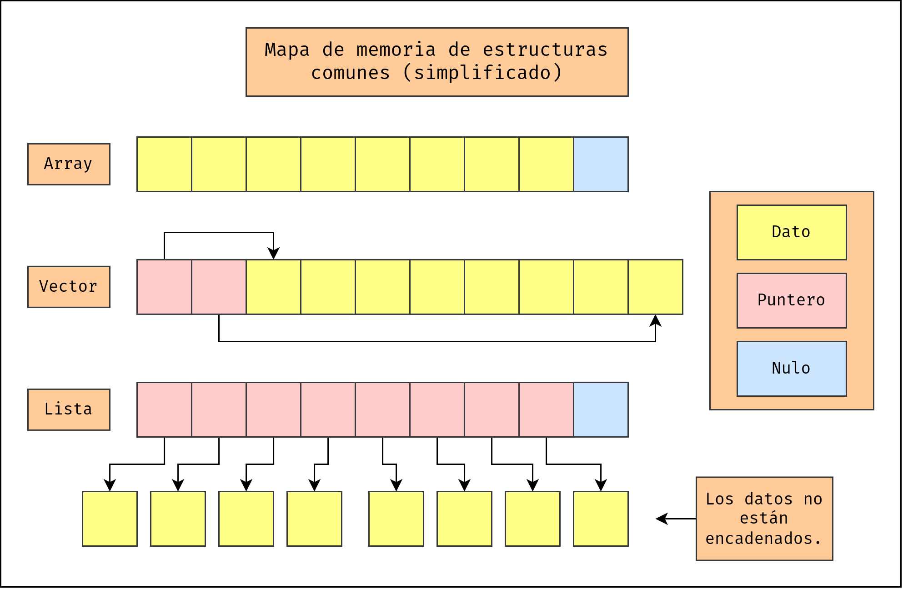
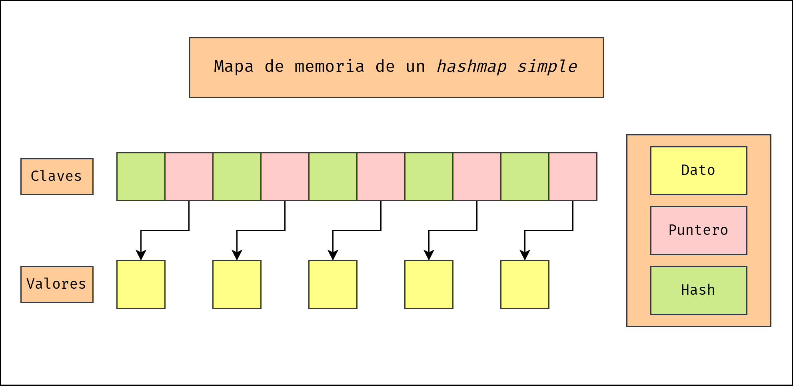

# Sesión 3 - Estructuras de datos y funciones avanzadas.  <!-- omit in toc -->

- [Listas.](#listas)
  - [Definir listas.](#definir-listas)
    - [Listas por comprensión.](#listas-por-comprensión)
  - [Operaciones y métodos.](#operaciones-y-métodos)
    - [Acceso.](#acceso)
    - [Iteración.](#iteración)
    - [Concatenación.](#concatenación)
    - [Inseción.](#inseción)
    - [Borrado.](#borrado)
    - [Pertenencia.](#pertenencia)
    - [Otros.](#otros)
- [Diccionarios.](#diccionarios)
  - [Definición.](#definición)
  - [Operaciones y métodos.](#operaciones-y-métodos-1)
    - [Acceso.](#acceso-1)
    - [Iteración.](#iteración-1)
    - [Unión e inserción.](#unión-e-inserción)
    - [Borrado.](#borrado-1)
    - [Pertenencia.](#pertenencia-1)
    - [Otros.](#otros-1)
  - [JSON.](#json)
  - [Desempaquetar diccionarios.](#desempaquetar-diccionarios)
- [Otras estructuras.](#otras-estructuras)
  - [Tuplas.](#tuplas)
  - [Sets.](#sets)
- [Funciones avanzadas.](#funciones-avanzadas)
  - [Funciones variádicas.](#funciones-variádicas)
  - [Generadores.](#generadores)
  - [Decoradores.](#decoradores)
  - [Funciones lambda.](#funciones-lambda)
  - [Colección de funciones.](#colección-de-funciones)
    - [filter](#filter)
    - [map](#map)
    - [zip](#zip)
    - [all, any](#all-any)
    - [partial](#partial)
    - [Itertools.](#itertools)


## Listas.

Las listas (`list`) son **estructuras mutables** donde los datos se disponen de forma sucesiva. A efectos prácticos, se comporta como un vector o array. Sin embargo, su estructura en la memoria se dispone de otra manera.



La disposición de memoria de la lista permite operaciones de inserción y eliminación más rápidas a costa de consumo de memoria. También permite que **los elementos de la lista puedan ser de cualquier tipo**. A diferencia de otros lenguajes como C o C++, la gestión de la memoria queda fuera del alcance del usuario.

Esta estructura aprovecha al máximo la abstracción de objetos presente en Python: como todos los elementos de Python derivan de `object` comparten la misma manera de reprensentarse en la memoria.

### Definir listas.

Las listas pueden contener cualquier tipo de dato, incluido otras listas:

```python
lista_numeros = [1, 2, 3]
lista_texto = ['hola', 'mundo', '!']
lista_mixta = [1, 'huevos', 3]
lista_cuadrado = [[1, 0], [0, 1]]
x, y = 0, 1
punto = [x, y]  # [0, 1]
```

Las listas también se pueden crear con iterables utilizando el constructor de la clase `list`:

```python
numeros = list(range(5))  # 1, 2, 3, 4, 5
letras = list('abcdef')  # a, b, c, d, e, f
elementos = list((2, 3, 'patatas'))  # 2, 3, patatas
```

#### Listas por comprensión.

También se pueden crear listas mediante una técnica llamada *list comprehensions*:

```
[ expresion(var) for var in iterable [if condición] ]
[ *iterable ]
```

Esto nos permite por ejemplo crear listas mediante expresiones:

```python
# Elevar elementos al cuadrado
datos = [3, 4, 3, 1, 2, 6, 7]
datos_cuadrado = [dato**2 for dato in datos]

# Lista de números pares del 1 al 20
pares = [numero for numero in range(1, 21) if numero % 2 == 0]
```

### Operaciones y métodos.

#### Acceso.

Para acceder a los elementos de una lista utilizamos los corchetes (`[]`) con la misma interfaz que con los strings (`str`):

```python
frutas = ['manzana', 'pera', 'kiwi', 'mango', 'plátano']
print(frutas[0])  # -> 'manzana'
print(frutas[-1])  # -> 'plátano'
print(frutas[2:])  # -> ['kiwi', 'mango', 'plátano']
print(frutas[1::2])  # -> ['pera', 'mango']
```

> ¡Cuidado! Recuerda que las estructuras son elementos mutables. Esto significa que cuando modificas una variable no cambias hacia donde haces referencia.

```python
lista_A = [1, 2, 3]
lista_B = lista_A
lista_B[1] = 5
print(lista_A)  # -> ¡También ha cambiado!
```

Para copiar una lista accedemos a todos sus valores mediante `[:]`:

```python
lista_A = [1, 2, 3]
lista_B = lista_A[:]
lista_B[1] = 5
print(lista_A)  # -> ¡Solucionado!
```

#### Iteración.

Podemos iterar directamente sobre los elementos de las listas:

```python
peliculas = ['Toy Story', 'The Big Lebowski', 'Big Fish']

for pelicula in peliculas:
    print(pelicula)
```

#### Concatenación.

Se pueden concaternar dos listas mediante el operador suma (`+`):

```python
ciudades_japon = ['Tokio', 'Osaka', 'Kioto']
ciudades_eeuu = ['Nueva York', 'San Francisco', 'Dallas']

ciudades = ciudades_japon + ciudades_eeuu
```

También se pueden realizar el producto de una lista por un escalar para conseguir elementos repetidos:

```python
vector_nulo = [0]*5
print(vector_nulo)  # -> [0, 0, 0, 0, 0]
```
> Hay un error muy recurrente que ocurre cuando se intenta crear una matriz de elementos iguales.

```python
matriz = [[0]*3]*3
matriz[0][0] = 1
print(matriz)  # ¡No queremos esto!
```

> Una forma correcta de hacerlo es:

```python
matriz = [[0]*3 for _ in range(3)]
```

#### Inseción.

Para añadir elementos utilizamos `append`, `extend` e `insert`.

```python
compra = []
compra.append('Huevos')
compra.append('Leche')
print(compra)  # ['Huevos', 'Leche']
compra.extend(['Arroz', 'Pimienta'])
print(compra)  # ['Huevos', 'Leche', 'Arroz', 'Pimienta']
compra.insert(0, 'Patatas')
print(compra)  # ['Patatas', 'Huevos', 'Leche', 'Arroz', 'Pimienta']
```

#### Borrado.

Para eliminar datos se dispone de los métodos `pop`, `remove`, `clear`.

```python
serpientes = ['Cobra Real', 'Pitón', 'Culebra', 'Mamba negra', 'Boa']
serpientes.pop()
print(serpientes)  # ['Cobra Real', 'Pitón', 'Culebra', 'Mamba negra']
serpientes.remove('Pitón') 
print(serpientes)  # ['Cobra Real', 'Culebra', 'Mamba negra']
serpientes.clear() 
print(serpientes)  # []
```

#### Pertenencia.

Se puede comprobar si un elemento pertenece o no a la lista con el operador `in`:

```python
alumnos = ['Lucas', 'María', 'Juan']
print('Lucas' in alumnos)  # -> True
print('Luiza' in alumnos)  # -> False
print('María' not in alumnos)  # -> False
print('Domingo' not in alumnos)  # -> True
```

#### Otros.

Otros métodos de la clase `list` son:

- `list.count(x)`: cuenta los elementos que coinciden con `x`. 
- `list.reverse()`: da la vuelta a la lista. 
- `list.copy()`: devuelve una copia de la lista, equivale a `list[:]`.
- `list.index(x[, start[, end]])`: devuelve el índice de la primera coincidencia de `x`.
- `list.sort(*, key=None, reverse=False)`: ordena la lista.

El último método funciona igual que la función `sorted(...)`, pero esta última devuelve una copia de la lista mientras que el método la modifica.

Python también cuenta con funciones que funcionan con cualquier tipo de secuencia, y por lo tanto con listas:

- `max(seq)`: devuelve el valor máximo.
- `min(seq)`: devuelve el valor mínimo.
- `len(seq)`: devuelve la longitud de la lista.
- `sum(seq)`: devuelve la suma de los elementos de la lista.

Más sobre listas en la documentación: https://docs.python.org/3/tutorial/datastructures.html#more-on-lists

### Ejercicio de clase.  <!-- omit in toc -->

Haz un módulo que realice las operaciones básicas (`+`, `-`, `*`) sobre matrices entendidas como listas anidadas.

```python
matriz_identidad = [[1, 0, 0], [0, 1, 0], [0, 0, 1]]
```

## Diccionarios.

Los diccionarios (`dict`) son **estructuras mutables** donde se guardan pares de datos clave-valor. Es el único tipo de clase *mapeable* que existe por defecto en Python e implementa una estructura tipo *hashmap*.



Un *hash* es el resultado de una **función *hash*** . Estas funciones "digirieren" una cadena de datos binarios en bruto y dan como resultado un valor numérico. La entropía en el cálculo es tan que tan solo cambiando un solo bit de cientos de bytes de entrada el resultado es completamente distinto.

> Existe una función *hash* por defecto en Python que podemos usar: `hash`.

### Definición.

Los diccionarios se construyen sobre pares de datos clave-valor. Las formas de definicr diccionarios son varias:

- Usando una lista separada por comas de pares `clave: valor` entre llaves: `{'jack': 4098, 'sjoerd': 4127} o {4098: 'jack', 4127: 'sjoerd'}`
- Usando una comprensión de diccionario: `{}`, `{x: x ** 2 for x in range(10)}`
- Usando un constructor de tipo: `dict()`, `dict([('foo', 100), ('bar', 200)]), dict(foo=100, bar=200)`

Las claves puede ser cualquier tipo de dato *hashable* (prácticamente todos), mientras que los valores pueden ser cualquier tipo de dato.

> Aunque las claves pueden ser tipo mutables es extremadamente inestable utilizar este tipo de objetos. Las claves no deben cambiar y es mejor que siempre sean tipos inmutables.

Los diccionarios se pueden anidar todo lo necesario para crear estructuras complejas:

```python
direccion = {'calle': 'Calle Faro', 'número': '8', 'piso':'5b', 'cp': 32001}
persona = {'nombre': 'José', 'apellidos': 'Castaño Ruiz', 'dni':'44322120Y'}
pedido = {'producto': 'zapatos', 'direccion': direccion, 'cliente': persona}
print(pedido)
```

### Operaciones y métodos.

#### Acceso.

Para acceder a los elementos de un diccionario utilizamos el operador de acceso `[]`:

```python
planetas = {'Tierra': 'roca', 'Marte': 'roca', 'Júpiter': 'gas'}
print('El planeta Júpiter está hecho de', planetas['Júpiter'])
```

Puede ocurrir que no estemos seguros de si un elemento está en el diccionario. Para acceder de forma segura podemos utilizar el método `get(clave, default=None)`, que nos dará el valor por defecto (`default`) que le pasemos:

```python
for planeta in ['Tierra', 'Venus', 'Marte', 'Saturno']:
    print('El planeta', planeta, 'está hecho de', planetas.get(planeta, 'algo'))
```
#### Iteración.

Podemos iterar sobre las claves (`keys`), valores (`values`) y ambos (`items`):

```python
kcal = {'coca cola': 353, 'hamburguesa': 606, 'patatas fritas': 523}

# Claves:
for comida in kcal.keys():
    print(comida, kcal[comida])
for comida in kcal: # Funciona igual, es el iterador por defecto
    print(comida, kcal[comida])

# Valores:
kcal_menu = [*kcal.values()]
print('El menú lleva', sum(kcal_menu), 'kcal.')

# Ambos
print('Desglose')
for comida, energia in kcal.items():
    print(f'{comida}:\t{energia}\t[kcal]')
```

#### Unión e inserción.

Para añadir un valor a un diccionario simplemente se asigna mediante su clave.

```python
sci_fi = {}
sci_fi['Star Wars'] = 1977
sci_fi['Star Trek'] = 1966
sci_fi['The Orville'] = 2017
```

Cuando queremos añadir varios elementos a un diccionario debemos utilizar el método `update`, que acepta otro diccionario. A partir de Python 3.9 se puede utilizar el operador de unión (`|`).

```python
westerns = {'Unforgiven': 1992, '3:10 to Yuma': 1957}
ficcion = {}
ficcion.update(westerns)
ficcion = ficcion | sci_fi  # igual
print(ficcion)
```

Los valores a la derecha de las expresiones tienen prioridad, sobrescribiendo el valor sobre claves similares.

#### Borrado.

Para eliminar de forma segura un elemento del diccionario usamos el método `pop`, que también retorna su valor:

```python
verduleria = {'coliflor': 1.2, 'patatas': 2.33, 'pimiento': 1.89}
verduleria.pop('coliflor')
print(verduleria)
```

#### Pertenencia.

Para saber si una clave está dispoble en un diccionario usamos el operador `in`:

```python
prefijos_telefono = {'es':34, 'fr':33, 'al': 49}

if 'ru' in prefijos_telefono:
    print('Llamando al Reino Unido con el prefijo', prefijos_telefono['ru'])
```

#### Otros.

Otros métodos interesantes de la clase `dict` son:

- `copy()`: Devuelve una copia del diccionario.
- `clear()`: Borra todos los elementos del diccionario.

También se le puede aplicar la función `len()` para obtener el número de elementos del diccionario.

### JSON.

Los diccionarios de Python son sintácticamente equivalentes a la representación de los datos en un JSON.

> JSON (acrónimo de JavaScript Object Notation, 'notación de objeto de JavaScript') es un formato de texto sencillo para el intercambio de datos.

Aunque veremos más adelante como leer y escribir apropiadamente archivos, es interesante aprender a leer archivos de tipo `.json` para leer y escribir información.

Para leer:

```python
import json  # Cargamos el módulo

with open(ruta_a_archivo, 'r') as archivo:
    datos = json.load(archivo)  # datos es un diccionario
```

Para escribir:

```python
import json  # Cargamos el módulo

with open(ruta_a_archivo, 'w') as archivo:
    json.dump(datos, archivo)
```

### Desempaquetar diccionarios.

Podemos hacer un desempaquetado profundo de un diccionario con el operador `**`. Esto devuelve una relación `clave=valor` que se puede utilizar en funciones:

```python
def producto(x, y):
    'Función cualquiera'
    return x*y

data = {'x': 1, 'y': 2}  # claves llamadas igual que argumentos.

print(producto(**data))
```

### Ejercicio de clase.  <!-- omit in toc -->

Crea una tabla de frecuencia absoluta y otra relativa de los siguientes números:

```
[5, 3, 3, 2, 9, 6, 4, 10, 3, 7, 9, 0, 8, 4, 0, 8, 0, 7, 10, 3, 5, 4, 4, 0, 0, 2, 9, 2, 8, 7, 5, 4, 3, 7, 10, 8, 10, 6, 3, 2, 6, 5, 6, 10, 3, 7, 6, 8, 5, 1, 6, 6, 6, 7, 3, 5, 5, 7, 5, 4, 7, 3, 6, 5, 3, 5, 7, 5, 6, 5, 5, 4, 6, 5, 6, 3, 4, 4, 5, 3, 5, 7, 4, 7, 4, 3, 4, 4, 5, 6, 4, 4, 4, 7, 4, 3, 7, 5, 5, 6]
```

## Otras estructuras.

### Tuplas.

Las tuplas (`tuple`) son **secuencias inmutables** de elementos. A efectos prácticos lo podemos considerar como una lista inmutable.

> El siguiente extrato está tomado literal de la documentación.

Las tuplas se pueden construir de diferentes maneras:

- Usando un par de símbolos de paréntesis, para indicar una tupla vacía: `()`.
- Usando una coma al final, para crear una tupla de un único elemento: `a,` o `(a,)`.
- Separando los elementos por comas: `a, b, c` o `(a, b, c)`.
- Usando la función incorporada `tuple()`: `tuple()` o `tuple(iterable)`.

El constructor genera una tupla cuyos elementos son los mismos y están en el mismo orden que los elementos del iterable, donde iterable puede ser una secuencia, un contenedor que soporta iteración, o un objeto de tipo iterator. Si iterable es ya de por si una tupla, se retorna sin cambiar. Por ejemplo, `tuple('abc')` retorna `('a', 'b', 'c')` y `tuple( [1, 2, 3] )` retorna `(1, 2, 3)`. Si no se indica ningún parámetro, el constructor creará una nueva tupla vacía. `()`.

Nótese que **es la coma la que realmente construye la tupla**, no los paréntesis. Los paréntesis son opcionales, excepto en el caso de la tupla vacía, o cuando se necesitan para evitar una ambigüedad sintáctica. Por ejemplo, `f(a, b, c)` es una llamada a una función con tres parámetros, pero `f((a, b, c))` es una llamada a una función con un único parámetro, en este caso una tupla de tres elementos.

### Sets.

Un objeto de tipo set (`set`, `frozenset`) es una colección no ordenada de distintos objetos *hashables*. Es una estructura tipo lista donde no pueden haber dos elementos iguales.

Los casos de uso habituales incluyen comprobar la pertenencia al conjunto de un elemento, eliminar duplicados de una secuencia y realizar operaciones matemáticas como la intersección, la unión, la diferencia o la diferencia simétrica.

No es una estructura demasiado importante... salvo para trabajar con conjuntos. Existe una versión mutable (`set`) e inmutable (`frozenset`).

Ver más en la documentación oficial: https://docs.python.org/es/3/library/stdtypes.html#set-types-set-frozenset

## Funciones avanzadas.

Con los nuevos conocimientos adquiridos en estructuras de datos podemos aprender un poco más sobre funciones.

### Funciones variádicas.

En matemáticas y en programación informática, una función variádica es una función de aridad indefinida, es decir, una que acepta un número variable de argumentos. 

En Python existe dos tipos de argumentos variádicos, de lista y de clave-valor. Los de lista se obtienen por su posición relativa y se guardan en un argumento de tipo `tuple` precedida por `*`.

```python
def print_doble(*elementos):
    'Imprime el doble de los elementos introducidos'
    for item in elementos:
        print(item*2)

print_doble(2, 4, 6)
```

Los argumentos variádicos de tipo clave-valor se obtienen de la asignación `clave=valor` y se guardan en un argumento de tipo `dict` precedido por `**`.

```python
def print_claves_valores(**mapeo):
    'Imprime el par clave->valor de argumentos variádicos.' 
    for clave in mapeo:
        print(clave, '->', mapeo[clave])

print_claves_valores(a=2, b=4, c=6)
```

Se pueden combinar ambos tipos con argumentos normales:

```python
def mezcla(a, b=0, *args, **kwargs): 
    '*args y **kwargs se suelen usar como argumentos variádicos genéricos.'
    print(a, b, args, kwargs)

mezcla(1, 2, 3, 4, 5, otro = 10)  # -> 1 2 (3, 4, 5) {'otro':10}
```

> Importante: se debe mantener el orden: primero siempre los argumentos variádicos de tipo lita y después los clave-valor.

### Generadores.

Los generadores son funciones que tienen la capacidad de producir series de valores iterables y que pueden ser pausadas para recuperar más tarde el control de la ejecución.

Un generador se define como una función normal pero en vez de usar `return` para devolver valores lo hace a través de `yield`.

```python
def mi_generador():
    yield 1  # Devuelve 1.
    yield 2  # Devuelve 2.
    yield 3  # Devuelve 3 y se para.

for i in mi_generador():
    print(i)  # -> 1, 2, 3
```

Si queremos precipiar el final de un generador antes de tiempo solo tenemos que hacer un `return` vacío.


```python
def letras_hasta_punto_o_final(texto):
    for c in texto:
        if c == '.':
            return
        yield c

for letra in letras_hasta_punto_o_final('Hola. Me llamo Juan.'):
    print(letra)  # -> H, o, l, a
```

Los generadores son herramientas muy potentes que simplifican y mejoran la estructura del programa. Es buena idea utilizarlos siempre que se pueda.

### Decoradores.

Las funciones, al igual que prácticamente todo en Python, son objetos. Por tanto, pueden ser referenciadas por variables y pasadas como argumentos a otras funciones. Teniendo esto en mente podríamos amplíar la funcionalidad de una función pasándola a otra función:

```python
def funcion_simple(a, b):
    'suma dos elementos'
    return a+b

def duplicar_salida(funcion):
    'duplica la salida de una función normal'
    def funcion_nueva(*args):
        return funcion(*args)*2
    return funcion_nueva

funcion_doble = duplicar_salida(funcion_simple)
print(funcion_doble(1, 1))  # -> 4
```

A una función como `duplicar_salida` se le conoce en Python como **decorador** (`decorator`) y tiene una sintaxis propia (mediante `@`) que permite simplificar el programa:

```python
@duplicar_salida
def otra_funcion(a, b):
    return a*b
print(otra_funcion(4, 4))  # -> 32
```

A la función `otra_funcion` la hemos 'decorado' con `duplicar_salida`. Los decoradores pueden contar además con argumentos. Solo hay que crear otra función que envuelva al decorador:

```python
def longitud_minima(dim = 1, default = 0):
    'Se asegura que la salida tenga la dimensión mínima'
    def decorador(funcion):
        'El decorador'
        def funcion_nueva(*args, **kwargs):
            retorno = funcion(*args, **kwargs)
            assert type(retorno) == list, 'El retorno debe ser una lista'
            if len(retorno) < dim:
                retorno.extend(default for _ in range(dim-len(retorno)))
            return retorno 
        return funcion_nueva
    return decorador

@longitud_minima(5)
def normalizar(array):
    maximo = max(array)
    return [i/maximo for i in array]

print(normalizar([1, 2, 4]))  # -> [0.25, 0.5, 1.0, 0, 0] 
```

Los decoradores aparecen en multitud de APIs y pueden ser integrados como métodos de clases, lo cual permite entre otras cosas modificar el comportamiento de funciones ya definidas a posteriori.

### Funciones lambda.

Las **funciones lambda** (también llamadas funciones anónimas) son funciones que en principio no están asociadas a un identificador (variable). Su sintaxis es:

```python
lambda var1, var2, ... : expresion
```

Aunque pueden ser guardadas, su uso principal es usarlas como argumento para otras funciones.

```python
for i in filter(lambda x: x%3 == 0, range(0,50)):  # Imprime los números múltiplos de 3
    print(i)

cubo = lambda x: x**3
print(cubo(5))
```

### Colección de funciones.

A continuación, una colección de funciones útiles integradas por defecto en Python (o en la *Standard Library*):

#### filter

`filter(filtro, iterable)` es una función que filtra los objetos que devuelve un iterador. En el ejercicio anterior hemos visto un ejemplo usándolo con funciones lambda.

```python
for char in filter(lambda c: c != ' ', 'Hola a todos.'):
    print(char)  # -> Imprime todos los caracteres menos los espacios. 
```

#### map

`map(funcion, iterable)` es una función que aplica una función a los objetos que devuelve un iterador. Es muy útil cuando se trabaja con series de datos.

```python
for i in map(lambda x: x**2, range(5)):
    print(i)  # imprime los valores al cubo
```

#### zip

`zip(*iterables)` es una función que permite iterar sobre varios iterables en paralelo, generando tuplas con un objeto por iterador.

```python
for i, j, k in zip(range(5), range(6, 10), range(11, 15)):
    print(i, j, k)

pescaderia = dict(zip(['lubina', 'merluza', 'atún'], [11.23, 14.32, 21.02]))
print(pescaderia)
```

#### all, any

Podemos determinar si todos los elementos de un iterable (lista, tupla, etc) son `True` con `all` o si al menos uno lo es `any`. 

```python
numeros = [2, 4, 12, 32, 58, 96]
if all(map(lambda n: n%2 == 0, numeros)):
    print('Todos son pares.')
```

#### partial

En el módulo `functools` podemos encontrar la función `partial` que nos permite pre-asignar algunos parámetros de una función.

```python
from functools import partial

print_prompt = partial(print, '>>')
print_prompt()  # -> >>
print_prompt('Hola mundo!')  # -> >> Hola mundo!
```

#### Itertools.

El módulo `itertools` contiene una colección de funciones muy útiles para tratar con iteradores. 

Documentación: https://docs.python.org/3/library/itertools.html?highlight=itertools#module-itertools

### Ejercicio de clase.  <!-- omit in toc -->

Crea ejemplos de código con las siguientes funciones de `itertools`:

- `cycle`
- `repeat`
- `accumulate`
- `chain`
- `zip_longest`
- `permutations`
- `combinations`