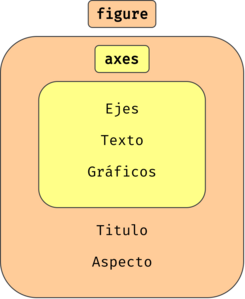
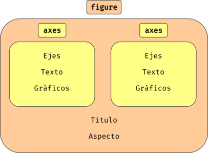
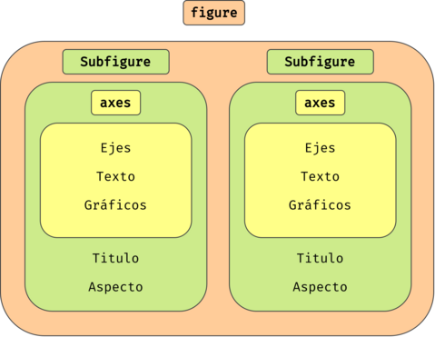

# Trabajando con datos en Python  <!-- omit in toc -->

## Archivos en Python

Python proporciona una serie de funciones integradas para trabajar con archivos. Estas funciones permiten abrir, leer, escribir y cerrar archivos en diferentes formatos, como texto, CSV, JSON, binario, etc.

Para abrir un archivo en Python, se utiliza la función `open()`. La sintaxis básica para abrir un archivo es la siguiente:

```python
archivo = open('nombre_del_archivo', 'modo')
```

Donde `nombre_del_archivo` es el nombre y la ubicación del archivo que se desea abrir, y `modo` indica el propósito de abrir el archivo, que puede ser para leer, escribir o agregar contenido al archivo.

Existen tres modos principales para abrir un archivo:

- `'r'`: modo de lectura (read). Este es el modo predeterminado. Se utiliza para leer un archivo existente.
- `'r+'`: modo de lectura y escritura (read + writing). Empiezas a escribir desde el comienzo del archivo.
- `'w'`: modo de escritura (write). Se utiliza para escribir contenido en un archivo. Si el archivo ya existe, su contenido será eliminado antes de escribir el nuevo contenido.
- `'w+'`: modo de escritura y lectura (read + writing). Como `'r+'` pero borra todo al inicio.
- `'a'`: modo de agregado (append). Se utiliza para agregar contenido al final de un archivo existente.
- `'a+'`: modo de agregado y lectura (append + read). Como `'r+'` pero empezando al final.

Si añades una `'b'` detrás de cualquier modo, **el fichero se abrirá en modo binario**. Esto se utiliza para cargar archivos en binario.

A continuación, te muestro algunos ejemplos de cómo utilizar estas funciones:

```python
# Abrir un archivo para lectura
archivo = open('archivo.txt', 'r')

# Leer el contenido del archivo y guardarlo en una variable
contenido = archivo.read()

# Imprimir el contenido del archivo
print(contenido)

# Cerrar el archivo
archivo.close()
```

```python
# Abrir un archivo para escritura
archivo = open('archivo.txt', 'w')

# Escribir contenido en el archivo
archivo.write('Este es el contenido que se va a escribir en el archivo.')

# Cerrar el archivo
archivo.close()
```


```python
# Abrir un archivo para agregar contenido
archivo = open('archivo.txt', 'a')

# Agregar contenido al archivo
archivo.write('\nEste es el contenido que se va a agregar al final del archivo.')

# Cerrar el archivo
archivo.close()
```

Es importante recordar cerrar el archivo después de terminar de trabajar con él, para asegurarse de que los cambios realizados en el archivo se guarden correctamente.

Además, es recomendable utilizar la declaración `with` al trabajar con archivos en Python. Esta declaración asegura que el archivo se cierre correctamente después de que se haya terminado de trabajar con él, incluso si ocurre un error durante la ejecución del código. La sintaxis para utilizar la declaración with con archivos es la siguiente:

```python
with open('nombre_del_archivo', 'modo') as archivo:
    # Trabajar con el archivo aquí
```

### Puntero de archivo.

En Python (y en otros lenguajes de programación), un puntero de archivo (también conocido como cursor de archivo) es una posición dentro del archivo que indica dónde se encuentra el próximo carácter o byte que se leerá o escribirá. El puntero de archivo se mueve automáticamente a medida que se leen o escriben los datos, pero también se puede mover manualmente a una posición específica dentro del archivo.

Python proporciona dos funciones para mover el puntero de un archivo: `seek()` y `tell()`.

La función `tell()` devuelve la posición actual del puntero de archivo dentro del archivo. Por ejemplo:

```python
with open('datos.txt', 'r') as archivo:
    print(archivo.tell())  # muestra la posición actual del puntero de archivo
```

La función `seek()` se utiliza para mover el puntero de archivo a una posición específica dentro del archivo. Toma dos argumentos: el primero indica la posición a la que se debe mover el puntero de archivo (medida en bytes desde el inicio del archivo), y el segundo indica desde dónde se debe realizar el desplazamiento (`0` para el inicio del archivo, `1` para la posición actual del puntero de archivo, o `2` para el final del archivo).

Por ejemplo, si queremos mover el puntero de archivo a la décima posición del archivo, podemos hacerlo de la siguiente manera:

```python
with open('datos.txt', 'r') as archivo:
    archivo.seek(9)  # mueve el puntero de archivo a la posición 9
    datos = archivo.read()  # lee los datos a partir de la posición 9
    print(datos)
```

En este ejemplo, utilizamos la función seek() para mover el puntero de archivo a la posición 9 (la décima posición, ya que la primera posición es 0), y luego utilizamos la función read() para leer los datos a partir de esa posición. La salida será los caracteres a partir de la décima posición del archivo.

Es importante tener en cuenta que, al mover el puntero de archivo manualmente, debemos asegurarnos de que estamos leyendo o escribiendo los datos en el lugar correcto del archivo.

### Archivos .csv

> Existen muchas interfaces para leer tipos de archivos concretos. Vamos a ver una para familiarizarnos con la interfaz más común: abrir archivo, cargarlo en la instancia de una clase, realizar operaciones y cerrarlo. 

Para leer archivos CSV (*Comma-Separated Values*) en Python, puedes utilizar el módulo `csv`. Este módulo proporciona una serie de funciones que facilitan la lectura y escritura de archivos CSV.

#### Leer.

La forma más común de leer un archivo CSV en Python es utilizando la función `csv.reader()`. Esta función toma como entrada un objeto archivo (devuelto por la función `open()`) y devuelve un objeto `reader`, que se puede iterar para leer cada línea del archivo CSV.

Aquí te muestro un ejemplo de cómo leer un archivo CSV utilizando la función `csv.reader()`:

Supongamos que tenemos un archivo CSV llamado `datos.csv` con la siguiente estructura:

```csv
nombre,edad,ciudad
Juan,25,Barcelona
María,32,Madrid
Pedro,27,Valencia
```

```python
import csv

with open('datos.csv', 'r', newline='') as archivo_csv:
    lector_csv = csv.reader(archivo_csv, delimiter=',')
    for fila in lector_csv:
        print(fila)
```

En este ejemplo, se abre el archivo CSV `datos.csv` utilizando la función `open()`, y luego utilizamos la función `csv.reader()` para crear un objeto reader que puede leer cada fila del archivo.

El parámetro `delimiter=','` indica que las columnas del archivo CSV están separadas por comas. Si el archivo CSV utiliza otro separador, se puede cambiar este parámetro para que coincida con el separador utilizado en el archivo.

> El parámetro `newline=''` se utiliza para garantizar que no se produzcan errores al leer el archivo CSV en diferentes sistemas operativos.

#### Escribir.

Para escribir archivos CSV en Python, también se utiliza el módulo `csv`. En particular, la forma más común de escribir un archivo CSV es utilizando la función `csv.writer()`, que toma como entrada un objeto archivo (devuelto por la función `open()`) y devuelve un objeto `writer`, que se puede utilizar para escribir datos en el archivo CSV.

```python
import csv

datos = [
    ['Juan', 25, 'Barcelona'],
    ['María', 32, 'Madrid'],
    ['Pedro', 27, 'Valencia']
]

with open('datos.csv', 'w', newline='') as archivo_csv:
    escritor_csv = csv.writer(archivo_csv, delimiter=',')
    for fila in datos:
        escritor_csv.writerow(fila)
```

En este ejemplo, creamos una lista llamada `datos` que contiene la información que queremos escribir en el archivo CSV. Cada elemento de la lista es otra lista que contiene los valores de cada columna.

Luego, abrimos un archivo CSV llamado datos.csv utilizando la función `open()` con el modo `'w'`, que indica que queremos escribir en el archivo (y que si ya existe, se sobrescribirá). También utilizamos el parámetro `newline=''` para garantizar que no se produzcan errores al escribir el archivo CSV en diferentes sistemas operativos.

A continuación, creamos un objeto writer utilizando la función `csv.writer()`, y especificamos el delimitador a utilizar para separar las columnas. En este caso, utilizamos la coma como delimitador.

Finalmente, iteramos sobre cada fila en la lista datos, y utilizamos el método `writerow()` del objeto writer para escribir cada fila en el archivo CSV.


### Ejercicio de clase. <!-- omit in toc -->

Crea un programa que registre usuarios. Debe pedir información a través de formulario de nombre, apellido, dni y fecha de nacimiento y guardar los registros en formato .csv.

## Numpy

**NumPy** es una librería de Python que se utiliza principalmente para realizar operaciones numéricas y matemáticas en arrays multidimensionales y matrices. Fue desarrollada para trabajar con datos numéricos y científicos, y se utiliza comúnmente en disciplinas como la física, la ingeniería, la informática, la estadística y la ciencia de datos.

> Para instalar NumPy:
> ```python
> py -m pip install numpy
> python3 -m pip install numpy
> ``` 

La principal característica de NumPy es su capacidad para trabajar con **matrices y arrays multidimensionales** de manera rápida y eficiente. Las operaciones en estas estructuras de datos se realizan a nivel de elementos, lo que significa que las operaciones son vectorizadas, lo que las hace mucho más rápidas que si se realizaran con bucles.

Algunas de las funcionalidades de NumPy son:

- Crear arrays multidimensionales y matrices.
- Realizar operaciones aritméticas básicas y avanzadas en matrices y arrays.
- Manipular y transformar matrices y arrays.
- Aplicar funciones matemáticas y estadísticas a matrices y arrays.
- Realizar operaciones de álgebra lineal, como la descomposición en valores singulares, la inversión de matrices y la solución de sistemas de ecuaciones lineales.

NumPy se utiliza en otras librerías de Python, como **Matplotlib** (para visualización de datos), **SciPy** (para computación científica) y **Pandas** (para análisis de datos). De facto, es el **estándar para la manipulación de datos numéricos en Python**.

### Funcionalidades básicas.

> Al importar se suele utilizar `numpy` como `np`.

#### Arrays unidimensionales.

```python
import numpy as np

arr = np.array([1, 2, 3, 4, 5])
print(arr)
```

#### Operaciones ariméticas..

Sobre todos los elementos a la vez:

```python
print(arr+3)  # Con el ejemplo anterior
print(arr*2)
print(arr**2)
# etc.
```

Elemento a elemento entre arrays compatibles:
```python
arr2 = np.array([3, 0, 1, 1, 1])
print(arr+arr2)
print(arr-arr2)
print(arr*arr2)
```

#### Matrices.

```python
import numpy as np

matriz = np.array([[1, 2, 3], [4, 5, 6]])
print(matriz)
```

También existe `matrix`, que funciona exactamente igual que array pero fuerza que sea de dimensión 2.

```python
import numpy as np

matriz_1 = np.matrix([[1, 2, 3], [4, 5, 6]])
matriz_2 = np.matrix([1, 2])  # Matriz de una fila, introduce la segunda dimensión.
print(matriz_1)
print(matriz_2)
```

Con `np.mat` se pueden introducir matrices con "sabor" Matlab.

```python
matriz_a = np.mat('4 3; 2 1')
matriz_b = np.mat('1 2; 3 4')
print(matriz_a)
print(matriz_b)
```

#### Operaciones con matrices.

```python
import numpy as np

matriz1 = np.array([[1, 2], [3, 4]])
matriz2 = np.array([[5, 6], [7, 8]])

suma = matriz1 + matriz2
resta = matriz1 - matriz2
producto = matriz1 * matriz2
producto_matriz = matriz1 @ matriz2
division = matriz1 / matriz2

print(suma)
print(resta)
print(producto)
print(producto_matriz)
print(division)
```

#### Álgebra lineal.

```python
import numpy as np

matriz = np.array([[1, 2], [3, 4]])
vector = np.array([5, 6])

# Multiplicar la matriz por el vector
producto = np.dot(matriz, vector)
print(producto)

# Calcular la inversa de la matriz
inversa = np.linalg.inv(matriz)
print(inversa)

# Resolver un sistema de ecuaciones lineales
sistema = np.array([[2, 3], [4, 5]])
solucion = np.array([5, 6])
resultado = np.linalg.solve(sistema, solucion)
print(resultado)
``` 

#### Funciones de construcción.

Existen funciones para crear arrays y matrices útiles de uso común:

- `arange([start,] stop[, step,])`: crea un rango numérico como `range`.
- `linspace(start, stop[, num,])`: devuelve un número de muestras uniformente espaciados entre dos rangos.
- `zeros(shape)`, `ones(shape)`, `full(shape, value)`: Devuelve un valor con la forma deseada.
- `identity(n)`: Devuelve la matriz identidad. 

```python
x = np.arange(0, 10, 0.5)
y = np.linspace(0, 10, 20)
ceros = np.zeros((2,2))  # Matriz 2x2
identidad = np.identity(3)

print(x)
print(y)
print(ceros)
print(identidad)
```

#### Métodos estadísticos.

```python
import numpy as np

matriz = np.array([[1, 2, 3], [4, 5, 6]])

# Calcular la media de la matriz
media = np.mean(matriz)
print(media)

# Calcular el máximo valor de la matriz
maximo = np.max(matriz)
print(maximo)

# Calcular la desviación estándar de la matriz
desviacion = np.std(matriz)
print(desviacion)
```

#### Funciones matemáticas.

Como las del módulo `math`, pero trabajan tanto con números como arrays.

```python
import numpy as np

a = np.sqrt(4)
b = np.sqrt([4, 25, 36])  # Transforma en array automáticamente
c = np.cos(np.pi)
d = np.log(np.e)
```

Estos son solo algunos ejemplos básicos de las funcionalidades que ofrece `NumPy`. Con esta librería, se pueden realizar operaciones mucho más avanzadas y complejas en arrays multidimensionales, lo que la hace una herramienta esencial en la ciencia de datos y otras disciplinas relacionadas.

### Tipos en NumPy.

En NumPy, los tipos de datos especifican cómo se almacenan y manipulan los datos en un array NumPy. Cada array NumPy tiene un tipo de datos asociado, que se puede obtener utilizando el atributo `dtype` del array.

NumPy proporciona una amplia variedad de tipos de datos, que se pueden clasificar en cuatro categorías principales:

1. **Números enteros** (integers): incluye enteros con signo (e.g., `int8`, `int16`, `int32`, `int64`) y enteros sin s gno (e.g., `uint8`, `uint16`, `uint32`, `uint64`).
2. **Números de punto flotante** (floating-point): incluye números de punto flotante de precisión simple (`float16`, `float32`) y doble precisión (`float64`).
3. **Números complejos (complex)**: incluye números complejos de precisión simple (`complex64`) y doble precisión (`complex128`).
4. **Booleanos (booleans)**: incluye valores `True` y `False` almacenados como números (`bool`).

Cada tipo de datos tiene un tamaño fijo en bytes, que se puede obtener utilizando el atributo `itemsize`. Por ejemplo, el tipo de datos `float64` tiene un tamaño de 8 bytes, mientras que el tipo de datos `int32` tiene un tamaño de 4 bytes.

Los tipos de datos también influyen en cómo se realizan las operaciones matemáticas en los arrays NumPy. Por ejemplo, si realizas una operación matemática entre dos arrays NumPy de tipos de datos diferentes, **NumPy realizará la conversión de tipo de datos automáticamente** para garantizar la compatibilidad. Sin embargo, ten en cuenta que **esta conversión de tipo puede introducir errores de redondeo** si los datos de los arrays son demasiado grandes o demasiado pequeños.

Aquí te presento algunos ejemplos de cómo se pueden crear arrays NumPy de diferentes tipos de datos:

```python
import numpy as np

# Crear un array NumPy de enteros sin signo de 8 bits
arr_uint8 = np.array([0, 1, 2, 3], dtype=np.uint8)

# Crear un array NumPy de punto flotante de 32 bits
arr_float32 = np.array([1.0, 2.0, 3.0, 4.0], dtype=np.float32)

# Crear un array NumPy de números complejos de 64 bits
arr_complex64 = np.array([1+2j, 3+4j, 5+6j], dtype=np.complex64)

# Crear un array NumPy de booleanos
arr_bool = np.array([True, False, True, False], dtype=np.bool)
```

Se puede cambiar el tipo de datos de un array NumPy existente utilizando el método astype(). Por ejemplo:

```python
# Cambiar el tipo de datos de un array NumPy existente
arr_float64 = arr_float32.astype(np.float64)
```

Es importante seleccionar el tipo de datos adecuado para tus datos y operaciones, ya que esto puede afectar la precisión, el rendimiento y el uso de memoria de tus cálculos.

### Ejercicio de clase. <!-- omit in toc -->

Calcula la derivada de la función `f(x) = x² - 2x + 1` en un intervalo usando NumPy. Sigue los siguientes pasos:

1. Crea un array de NumPy llamado `x` que contenga 101 valores de 0 a 10 con un incremento de 0.1.
2. Crea un array de NumPy llamado `y` que contenga los valores de la función `f(x) = x² - 2x + 1` para cada valor en el array `x`.
3. Utiliza la función `np.gradient()` para calcular la derivada de la función y en función de `x`. La derivada debe ser almacenada en una variable llamada `derivada`. 
    > Lee la documentación sobre [`np.gradient()`](https://numpy.org/doc/stable/reference/generated/numpy.gradient.html)
4. Imprime los valores de x, y y derivada.


## Matplotlib

**Matplotlib** es una biblioteca de visualización de datos en Python que permite crear una amplia variedad de gráficos, desde gráficos de líneas hasta gráficos de barras y gráficos de dispersión. Esta biblioteca es muy útil para representar los datos de una manera fácil y comprensible.

Matplotlib es una biblioteca muy extensa con muchas funciones y características diferentes, por lo que puede tomar tiempo aprender a utilizarla correctamente. Sin embargo, una vez que te familiarices con la sintaxis y las opciones disponibles, podrás crear gráficos de alta calidad y personalizados con facilidad.

El ejemplo más sencillo que se puede hacer es un gráfico de líneas. Para ello usamos la función `plt.plot()`. El siguiente código crea un gráfico de línea simple que muestra los valores de un conjunto (`y`) en función de los valores de otro (`x`):

```python
import matplotlib.pyplot as plt

x = [0, 3, 6, 9, 12]
y = [2, 4, 3, 6, 5]

plt.plot(x, y)
plt.show()
```

Para personalizar el gráfico, puedes utilizar varias funciones y opciones disponibles en Matplotlib, como `plt.title()` para agregar un título al gráfico, `plt.xlabel()` y `plt.ylabel()` para agregar etiquetas a los ejes `x` e `y`, y `plt.legend()` para agregar una leyenda al gráfico.

```python
import matplotlib.pyplot as plt

x = [0, 3, 6, 9, 12]
y = [1, 0.9, 1.2, 1.25, 1.20]

plt.plot(x, y, label='Precio normalizado.')
plt.title('Evolución de precios 2022')
plt.xlabel('Meses')
plt.ylabel('Valor normalizado')
plt.legend()
plt.show()
```

### Arquitectura

Las ventanas y gráficos de Matplotlib siguen la siguiente arquitectura.

Figura Simple:  

 

Figura con dos `axes`:  

 

Figura compuesta de subfiguras:  



En Matplotlib existen tres elementos principales: `figure`, `axes`, `axis`. 

#### Clase `Figure`

Los objetos de la clase `Figure` representan la ventana en la que se muestra el gráfico o la visualización. Es el contenedor principal para los elementos gráficos en Matplotlib y se puede pensar en él como el lienzo en el que se dibuja el gráfico.

Para crear un objeto `Figure`, se puede utilizar la función `plt.figure()`. Por ejemplo, el siguiente código crea un objeto Figure con un tamaño de 8 pulgadas de ancho por 6 pulgadas de alto:

```python

import matplotlib.pyplot as plt

fig = plt.figure(figsize=(8, 6))
```

> Si no creamos ninguna figura, todos las funciones contenidas en `matplotlib.pyplot` hacen referencia a una figura genérica que existe por defecto.

#### Clase `Axes`

En los objetos de la clase `Axes` es donde se dibujan los elementos gráficos en Matplotlib, como líneas, puntos y barras. Cada objeto `Figure` puede tener uno o varios objetos Axes.

Para crear una instancia de `Axes`, se suele utilizar el método `fig.add_subplot()` de una figura, que toma tres argumentos: el número de filas, el número de columnas y el número de Axes en el que se desea dibujar el gráfico. Por ejemplo, el siguiente código crea un objeto `Figure` con un objeto `Axes`:

```python
import matplotlib.pyplot as plt

fig = plt.figure(figsize=(8, 6))
ax = fig.add_subplot(1, 1, 1)  # Fila, columna, índice
```

En este caso, se crea un objeto `Figure` y se especifica que se desea un único objeto `Axes` en una sola fila y una sola columna. En los objetos de `Axes` es donde realizamos el `plot`.

```python
x = np.linspace(0, 1)
y = np.exp(x)

ax.plot(x, y)
fig.show()
```

> En la figura genérica ya existe una instancia de `Axes` y puedes *plotear* directamente con `plt.plot()` así como cambiar los parámetros de la instancias (`plt.set_title()`, `plt.set_xlim()`, etc.).

Puedes crear varios `axes` en la misma figura, un ejemplo sería:

```python
import matplotlib.pyplot as plt

fig = plt.figure(figsize=(16, 6))
ax1 = fig.add_subplot(1, 2, 1)  # Eje 1
ax2 = fig.add_subplot(1, 2, 2)  # Eje 2

ax1.set_title('Eje 1')
ax2.set_title('Eje 2')

x = np.linspace(0, 1)

ax1.plot(x, x**2)
ax2.plot(x, 1/(x+1))
fig.show()
```

O también varios gráficos en el mismo `axes`:

```python
import matplotlib.pyplot as plt

fig = plt.figure(figsize=(8, 6))

x = np.linspace(0, 1)

ax = fig.add_subplot(1, 1, 1)
ax.set_title('Eje Múltiple')
ax.plot(x, x**2)
ax.plot(x, 1/(x+1))

fig.show()
```

#### Clase `Axis`

El objeto `Axis` es el objeto que define los límites y la escala de los ejes en el gráfico. Hay un objeto `Axis` para cada eje en un objeto Axes.

Los objetos `Axis` se crean automáticamente cuando se dibuja un gráfico y se ajustan automáticamente para adaptarse a los datos dibujados en el gráfico. Normalmente se modifican directamente desde una instancia de `Axes`.

### Guardar gráficos.

Para guardar una figura en Matplotlib, puedes usar la función `savefig()` que permite guardar la imagen en diferentes formatos de archivo, como PNG, PDF, SVG, entre otros.

La sintaxis general para guardar una figura en Matplotlib es la siguiente:

```python
import matplotlib.pyplot as plt

# Aquí se grafica la figura

plt.savefig('nombre_archivo.formato', dpi=resolucion)
```

En esta sintaxis, la función `savefig()` recibe dos argumentos principales: el nombre del archivo y el formato del archivo en el que se desea guardar la figura. Por ejemplo, si deseas guardar la figura como un archivo PNG, el nombre del archivo deberá incluir la extensión `.png`.

Además, la función `savefig()` también incluye un argumento opcional `dpi` que te permite ajustar la resolución de la figura. Por defecto, `dpi` es 100, pero puedes aumentar o disminuir este valor según tus necesidades.

Por ejemplo, si deseas guardar una figura como un archivo PNG con una resolución de 300 DPI, puedes usar el siguiente código:

```python
import matplotlib.pyplot as plt

# Aquí se grafica la figura

plt.savefig('nombre_archivo.png', dpi=300)
```

### Tutorial de Matplotlib.

Matplotlib es una herramienta enorme y no es posible abarcar todas las funciones, clases, métodos, etc. en este curso. Sin embargo contamos con una buena documentación con tutoriales y recetas en la página oficial de Matplotlib.

> [Tutoriales de Matplotlib](https://matplotlib.org/stable/tutorials/index.html).  
> [Referencia](https://matplotlib.org/stable/api/index.html).  
> [Recetas](https://matplotlib.org/stable/plot_types/index.html) 

Veremos el funcionamiento de la librería con ejemplos.

### Ejercicio de clase. <!-- omit in toc -->

Dibuja un círculo de radio `1` centrado en `(0,0)`.

### Ejercicio de clase. <!-- omit in toc -->

Dibuja la función `f(x) = x**3 - x**2 - 2*x + 1` en el intervalo `[-10, 10]` y añade una recta con el valor de la derivada en `-4`.

### Ejercicio de clase. <!-- omit in toc -->

Dibuja la función `f(x) = x**3 - x**2 - 2*x + 1` en el intervalo `[-10, 10]` y añade una recta con el valor de la derivada en `-4`.


## Pandas.

Pandas es una biblioteca de Python que se utiliza para manipular y analizar datos de forma eficiente y efectiva. Se basa en dos estructuras de datos principales: las series (`Series`) y los marcos de datos (`DataFrames`). Pandas proporciona herramientas para la lectura y escritura de datos en varios formatos, la limpieza y transformación de datos, la agregación y el filtrado de datos, y la visualización de datos.

### Instalación

Para instalar Pandas, puedes utilizar `pip`, el gestor de paquetes de Python. Simplemente abre una terminal y escribe:

```bash
py -m pip install pandas  # en windows
python3 -m pip install pandas  # en linux, mac
```

La convención más común para importar `pandas` es utilizando el alias `pd`.

```python
import pandas as pd
```

### Series.

Las series son una estructura de datos unidimensional en Pandas. Pueden contener cualquier tipo de datos, incluyendo números, cadenas de texto y fechas. Para crear una serie en Pandas, puedes utilizar la el constructor de la clase `Series()`.

```python
import pandas as pd

serie = pd.Series([1, 2, 3, 4, 5])
```

En este ejemplo, hemos creado una serie que contiene los números del 1 al 5.

### DataFrames

Los marcos de datos son una estructura de datos bidimensional en Pandas. Son similares a una hoja de cálculo o una tabla de base de datos. Para crear un marco de datos en Pandas, puedes utilizar el constructor de la clase `DataFrame()`.

```python
import pandas as pd

datos = {'nombre': ['Juan', 'María', 'Pedro'], 'edad': [25, 32, 27], 'ciudad': ['Barcelona', 'Madrid', 'Valencia']}

marco_datos = pd.DataFrame(datos)
```

En este ejemplo, hemos creado un marco de datos que contiene información sobre tres personas, incluyendo su nombre, edad y ciudad.

### Cargar datos.

Para trabajar con datos en Pandas, primero debemos cargarlos en una estructura de datos de Pandas. Pandas admite muchos formatos de datos, como CSV, Excel, JSON, SQL, entre otros.

```python
# Cargar un archivo CSV
datos = pd.read_csv('datos.csv')

# Cargar un archivo Excel
datos = pd.read_excel('datos.xlsx')

# Cargar datos desde una base de datos SQL
import sqlite3
conexion = sqlite3.connect('bd.sqlite')
datos = pd.read_sql_query('SELECT * FROM tabla', conexion)
```

### Explorar los datos

Después de cargar los datos, es importante explorarlos para entender su estructura, contenido y calidad. Para esto, Pandas proporciona una serie de funciones para inspeccionar los datos.

```python
# Ver las primeras filas de un DataFrame
datos.head()

# Ver las últimas filas de un DataFrame
datos.tail()

# Ver la estructura del DataFrame
datos.info()

# Ver estadísticas básicas del DataFrame
datos.describe()

# Contar los valores únicos en una columna
datos['columna'].value_counts()
```

### Seleccionar y filtrar datos.

En Pandas, podemos seleccionar y filtrar datos basados en una o varias condiciones. También podemos seleccionar columnas específicas o subconjuntos de filas y columnas.

```python
# Seleccionar una columna
datos['columna']

# Seleccionar varias columnas
datos[['columna1', 'columna2']]

# Filtrar filas basado en una condición
datos[datos['columna'] > 10]

# Combinar varias condiciones con operadores lógicos
datos[(datos['columna1'] > 10) & (datos['columna2'] < 20)]

# Seleccionar filas y columnas basado en etiquetas o posiciones
datos.loc[etiquetas_fila, etiquetas_columna]
datos.iloc[posiciones_fila, posiciones_columna]
```

### Manipular y transformar datos.

En Pandas, hay muchas formas de manipular y transformar datos. A continuación, se presentan algunas de las operaciones más comunes:

#### Agregar una nueva columna.

Para agregar una nueva columna en un `DataFrame`, podemos utilizar la sintaxis `df['nueva_columna'] = valores`.

```python
import pandas as pd

# Cargar datos
datos = pd.read_csv('datos.csv')

# Agregar una nueva columna
datos['total'] = datos['precio'] * datos['cantidad']
```

#### Aplicar una función a cada elemento de una columna.

Para aplicar una función a cada elemento de una columna en un `DataFrame`, podemos utilizar la función `apply()`.

```python
import pandas as pd

# Cargar datos
datos = pd.read_csv('datos.csv')

# Definir una función
def impuesto(precio):
    return precio * 0.15

# Aplicar la función a la columna 'precio'
datos['impuesto'] = datos['precio'].apply(impuesto)
```

#### Agrupar y aplicar una función de agregación.

Para agrupar los datos por una o varias columnas y aplicar una función de agregación a una columna específica, podemos utilizar la función `groupby()`.

```python
import pandas as pd

# Cargar datos
datos = pd.read_csv('datos.csv')

# Agrupar por la columna 'categoria' y calcular la suma de la columna 'cantidad'
resumen = datos.groupby('categoria')['cantidad'].sum()
```

#### Fusionar Dataframes.

Para fusionar dos `DataFrame` basados en una o varias columnas en común, podemos utilizar la función `merge()`.

```python
import pandas as pd

# Cargar datos
datos1 = pd.read_csv('datos1.csv')
datos2 = pd.read_csv('datos2.csv')

# Fusionar los DataFrames basados en la columna 'id'
fusionado = pd.merge(datos1, datos2, on='id')
```

#### Pivotar.

Para pivotar una tabla, es decir, reorganizar los datos de una columna en filas y las etiquetas de otra columna en columnas, podemos utilizar la función `pivot()`. 

```python
import pandas as pd

# Cargar datos
datos = pd.read_csv('datos.csv')

# Pivotar la tabla por la columna 'categoria' y la columna 'mes'
pivotado = datos.pivot(index='categoria', columns='mes', values='cantidad')
```

Estas son solo algunas de las operaciones más comunes que se pueden realizar en Pandas. La biblioteca proporciona muchas más funciones y métodos para manipular y transformar datos, por lo que es importante revisar la documentación de Pandas para obtener más información.

## Jupyter.

**Jupyter** es una plataforma de código abierto para crear y compartir documentos interactivos que contienen código en vivo, ecuaciones, visualizaciones y texto narrativo. Es muy popular en la comunidad de análisis de datos y ciencia de datos porque permite crear y compartir cuadernos interactivos con código en vivo, lo que lo convierte en una herramienta muy útil para explorar, visualizar y comunicar datos.

La plataforma Jupyter soporta varios lenguajes de programación, pero es especialmente popular para Python. **Jupyter Notebook**, la aplicación más común en la plataforma, permite a los usuarios escribir y ejecutar código Python en celdas individuales, lo que facilita la iteración y la experimentación. Además, los cuadernos Jupyter pueden incluir texto explicativo, gráficos y multimedia para ayudar a explicar y visualizar los datos.

Los cuadernos Jupyter son muy útiles para la colaboración porque pueden ser compartidos y editados por otros usuarios. Esto significa que los analistas de datos pueden trabajar juntos en un proyecto y revisar y comentar el trabajo de los demás en tiempo real. También se pueden exportar los cuadernos a varios formatos, incluyendo HTML, PDF y Markdown, lo que facilita la presentación y la distribución de los resultados de un análisis.

### Jupyter en local.

**Jupyper** es una plataforma que se ejecuta en segundo plano en el ordenador u servidor.

A continuación, se presenta un resumen de cómo utilizar **Jupyter**:

1. **Instalación**. Antes de utilizar Jupyter, es necesario instalarlo en su computadora. Se puede instalar usando el administrador de paquetes de Python, pip, mediante el comando:
> ```bash
> py -m pip install jupyter
> python3 -m pip install jupyter
> ```

2. **Iniciar Jupyter Notebook**. Una vez instalado, podemos iniciar Jupyter Notebook ejecutando el siguiente comando en la línea de comandos:
> ```bash
> jupyter notebook
> ```
- El cuaderno se abrirá en el navegador.

3. **Crear un nuevo cuaderno**. Una vez que se abre Jupyter Notebook, se puede crear un nuevo cuaderno haciendo clic en el botón "New" y seleccionando "Python 3". Esto creará un nuevo cuaderno en el que se puede comenzar a escribir código.

4. **Ejecutar código.** Para ejecutar el código en una celda de un cuaderno, presione `Shift + Enter` o haga clic en el botón "Run" en la barra de herramientas.

5. **Agregar texto y gráficos**. Jupyter Notebook permite agregar texto explicativo y gráficos a un cuaderno, lo que lo hace ideal para documentar y compartir el trabajo. Para agregar texto, simplemente escriba el texto en una celda de tipo "Markdown". Para agregar gráficos, utilice una biblioteca de visualización de datos, como Matplotlib o Seaborn.

6. **Guardar y compartir**. Cuando termine de trabajar en un cuaderno, es importante guardarlo para poder volver a él en el futuro. Para guardar un cuaderno, haga clic en el botón "Save" en la barra de herramientas. También puede exportar un cuaderno como un archivo HTML, PDF o Markdown para compartirlo con otros.

### Jupyter en vscode.

Existe un plugin en vscode que permite integrar el core de Jupyter en vscode y poder editar los cuadernos desde ahí.

### Google collab.

**Google Colaboratory**, también conocido como **Google Colab**, es una plataforma en línea gratuita que permite a los usuarios escribir y ejecutar código en lenguaje Python. Colab se ejecuta en la nube de Google y proporciona acceso a recursos informáticos de alta gama, como CPU, GPU y TPU, que se utilizan para acelerar el procesamiento de datos y el entrenamiento de modelos de aprendizaje automático.

**La interfaz de Colab es similar a la de Jupyter Notebook** y ofrece una amplia gama de funcionalidades, incluyendo la edición de texto, la ejecución de código, la visualización de datos, la creación de gráficos, el uso de bibliotecas de Python y la colaboración en tiempo real con otros usuarios.

Colab también viene con una gran cantidad de bibliotecas de Python preinstaladas, lo que hace que sea fácil y rápido comenzar a trabajar en un proyecto. Además, Colab proporciona un almacenamiento en la nube gratuito y permite a los usuarios cargar sus propios conjuntos de datos, lo que significa que se pueden realizar experimentos y análisis sin tener que preocuparse por el espacio de almacenamiento local.

> [Ejemplo de cuaderno](https://colab.research.google.com/notebooks/welcome.ipynb?hl=es#scrollTo=-gE-Ez1qtyIA).

### Ejercicio de clase. <!-- omit in toc -->

> Realiza el siguiente ejercicio en un cuaderno Jupyter y usando pandas.

Se realiza un test de fatiga sobre tres modelos de interruptores. La empresa está buscando un modelo de alto rendimiento y debe cumplir las siguientes condiciones:

- La vida media de los interruptores debe superar las 95.000 conmutaciones.
- El 1% de los interruptores debe superar las 80.000 conmutaciones.

Los datos se han recogido en un csv (`switches.csv`).

- Carga los datos con `pandas`.
- Calcula si superan los test.
- Grafica los datos de los tres modelos con `matplotlib`. Muestra de cada:
  - La distribución resultante.
  - Una línea vertial en el 1% y en la media.

> Pista: puedes usar en pandas el método `quantiles()` para calcular uno o más cuantiles.

## Otros módulos.

### SciPy.

**SciPy** es una biblioteca de software libre para Python que proporciona herramientas y algoritmos para la computación científica y el análisis de datos. Esta biblioteca se construye sobre NumPy, otra biblioteca de Python para la manipulación de matrices y arreglos de datos, y se utiliza ampliamente en la comunidad científica y de ingeniería.

SciPy incluye módulos para optimización, álgebra lineal, estadísticas, procesamiento de señales y de imágenes, entre otros. Algunas de las funcionalidades más populares de SciPy incluyen la resolución de ecuaciones diferenciales, la optimización de funciones, el análisis de datos estadísticos y el procesamiento de imágenes y señales.

Una de las ventajas de SciPy es que proporciona algoritmos optimizados y de alto rendimiento que permiten el procesamiento de grandes cantidades de datos de manera eficiente. También es fácil de usar y se integra bien con otras bibliotecas de Python, como NumPy, Pandas y Matplotlib.

> Documentación y recursos de [SciPy](https://docs.scipy.org/doc/scipy/).

### SymPy

**SymPy** es una biblioteca de software libre para Python que proporciona herramientas para el cálculo simbólico. Esta biblioteca se utiliza en la comunidad científica y de ingeniería para trabajar con ecuaciones y expresiones matemáticas de manera simbólica en lugar de numérica.

SymPy proporciona funcionalidades para la simplificación de expresiones, la integración, la derivación, la solución de ecuaciones y sistemas de ecuaciones, la expansión de series y la representación gráfica de funciones, entre otras. La biblioteca también es compatible con la mayoría de las funciones de Python y se integra bien con otras bibliotecas científicas, como NumPy y SciPy.

Una de las principales ventajas de SymPy es que permite trabajar con expresiones matemáticas de manera simbólica, lo que es especialmente útil en campos como la física, la ingeniería, las matemáticas y la ciencia de datos. Además, SymPy es fácil de usar, cuenta con una amplia documentación y tiene una comunidad activa de desarrolladores.

> Documentación y recursos de [SymPy](https://docs.sympy.org/latest/index.html).