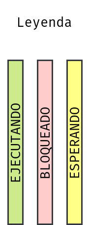
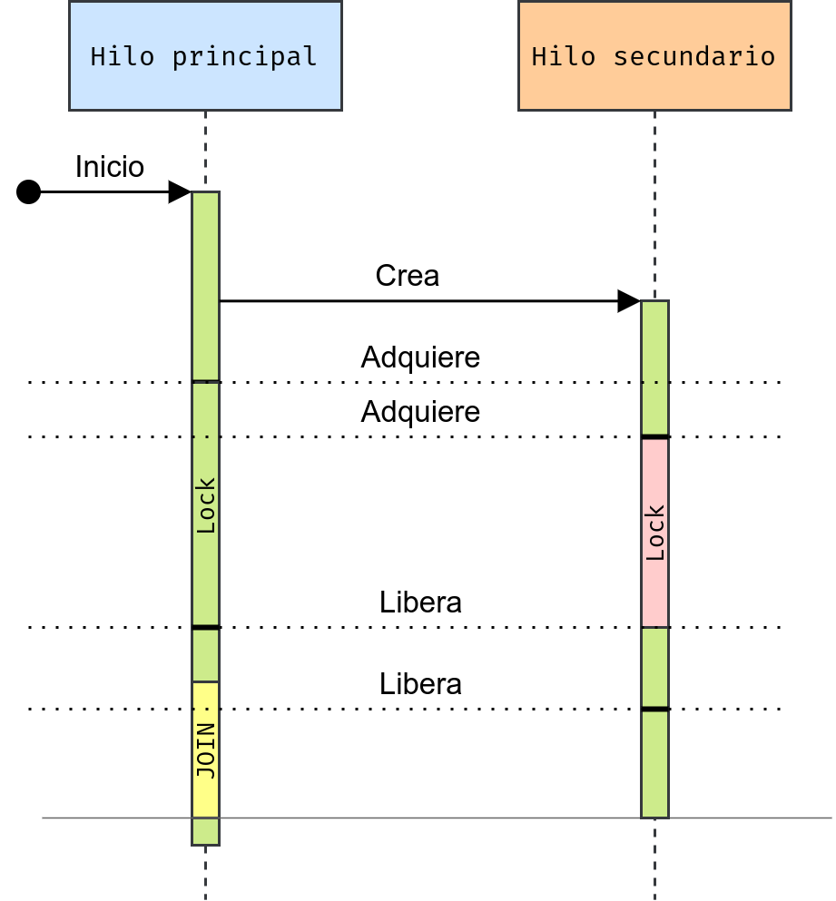
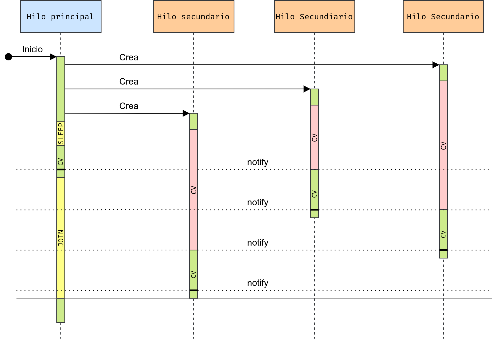
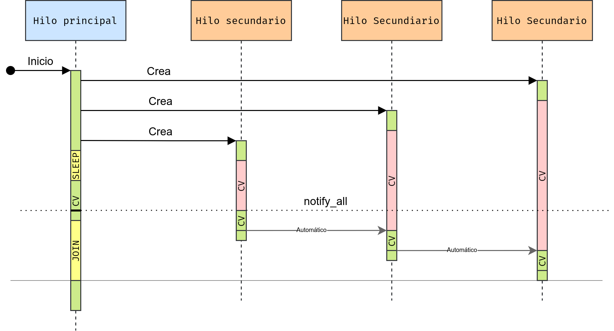
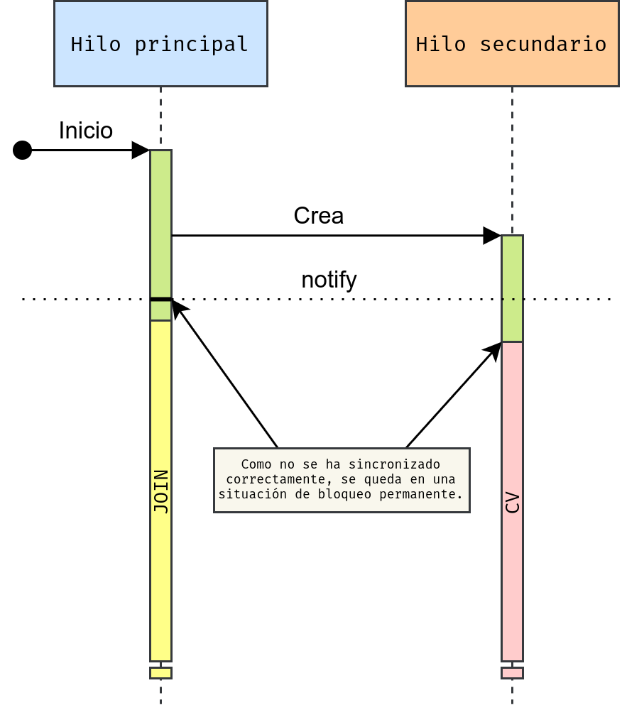
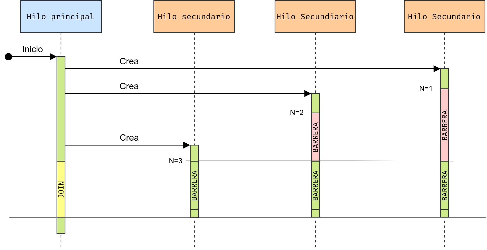
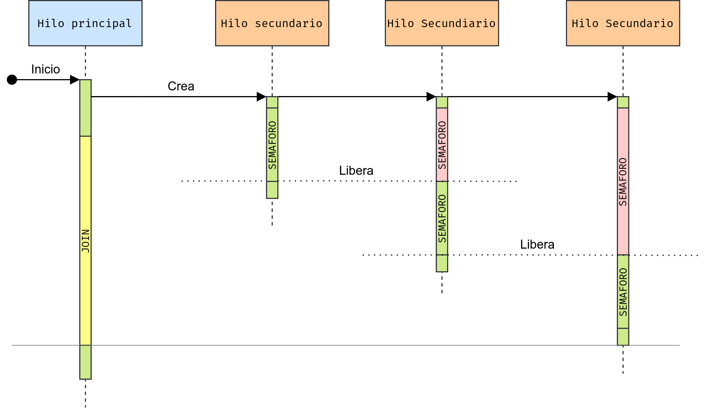

# Primitivas de sincronización. <!-- omit in toc -->

- [Primitivas de sincronización.](#primitivas-de-sincronización)
  - [Lock](#lock)
  - [Variables de condición.](#variables-de-condición)
  - [Barreras.](#barreras)
  - [Semáforos.](#semáforos)
  - [Eventos.](#eventos)
- [Colas (Queues).](#colas-queues)


## Primitivas de sincronización.

En concurrencia, las **primitivas de sincronización** son herramientas que se utilizan para coordinar la ejecución de hilos en un programa multi-hilo. Estas primitivas son necesarias para evitar problemas como condiciones de carrera, bloqueos mutuos y otros tipos de conflictos entre hilos.

Algunas de las primitivas de sincronización más comunes incluyen:

- **Locks**: Un "lock" o "bloqueo" es una primitiva que permite a un hilo adquirir exclusividad en un recurso compartido. Cuando un hilo adquiere un lock, ningún otro hilo puede acceder al recurso y se bloquea hasta que el lock se libera.

- **Variables de condición**: Una "variable de condición" es una primitiva que permite a los hilos esperar hasta que se cumpla una cierta condición. Los hilos pueden esperar en una variable condicional hasta que otro hilo despierta a todos los hilos que están esperando.

- **Barreras**: Una "barrera" es una primitiva que se utiliza para bloquear el progreso de un hilo hasta que un número determinado de otros hilos llegan a la barrera. Las barreras se utilizan a menudo para asegurar que todos los hilos hayan completado ciertas tareas antes de continuar.

- **Semáforos**: Un "semáforo" es una primitiva que se utiliza para limitar el acceso concurrente a un recurso compartido. Los semáforos tienen un valor asociado que se utiliza para controlar el acceso a un recurso compartido.

- **Eventos**: es una primitiva de sincronización que permite a los hilos esperar hasta que otro hilo señale que ha ocurrido un evento. Se puede considerar como una variable booleana que se inicializa en falso y se establece en verdadero por otro hilo.

Para una mejor comprensión de las primitivas de sincronización se incluyen **diagramas de secuencia** donde se muestra el estado de ejecución de los hilos (ejecutándonse, bloqueado o esperando).



### Lock

En Python, un `Lock` es una primitiva de sincronización que se utiliza para garantizar que un recurso compartido, como una variable o una sección crítica del código, sea accedido por un solo hilo a la vez. Un `Lock` se crea utilizando la clase `threading.Lock()` y se puede utilizar para proteger cualquier recurso compartido.

La idea básica detrás de un `Lock` es que solo un hilo puede adquirirlo en un momento dado. Si un hilo intenta adquirir un `Lock` que ya ha sido adquirido por otro hilo, **el hilo se bloqueará y esperará hasta que el `Lock` esté disponible**.

Para utilizar un `Lock` en Python, primero se debe crear una instancia de `Lock`:
    
```python
import threading

lock = threading.Lock()
```

Para proteger un recurso compartido, se adquiere el `Lock` utilizando el método `acquire()`. Una vez que se adquiere el `Lock`, el hilo puede acceder al recurso compartido. Después de que el hilo haya terminado de acceder al recurso compartido, debe liberar el `Lock` utilizando el método `release()`.

```python
lock.acquire()
# Acceder al recurso compartido
lock.release()
```

**Es importante tener en cuenta que se debe liberar el `Lock` después de que se haya terminado de acceder al recurso compartido**. Si se olvida de liberar el `Lock`, otros hilos que intenten adquirirlo quedarán bloqueados para siempre.

En general, se recomienda utilizar un bloque `with` para adquirir y liberar un `Lock`, ya que garantiza que el `Lock` se liberará incluso en caso de que ocurra una excepción:

```python
with lock:
    # Acceder al recurso compartido
```

Veamos un ejemplo en el que el hilo principal cuenta hasta 10 y el hilo secundario espera hasta que termina y luego cuenta hacia atrás hasta 0:

```python
import threading
import time

contador = 0

def hilo_lock(lock: threading.Lock):
    "Decrementa el contador"
    global contador

    print("Empiezo el hilo.")
    time.sleep(0.1)  # Me aseguro de que lo coge después
    with lock:
        print("Desde el hilo adquiero el Lock.")
        while contador > 0:
            contador -= 1
            time.sleep(0.5)
            print(contador)
    print("Fin desde el hilo.")

lock = threading.Lock()

hilo = threading.Thread(target=hilo_lock, args=(lock,))

hilo.start()

with lock:
    print("Adquiero el Lock desde el main.")
    while contador < 10:
        contador += 1
        time.sleep(0.5)
        print(contador)
    print("Libero el Lock.")

hilo.join()
```

La secuencia se resuelve del siguiente modo:



> En C++ y otros muchos lenguajes, este tipo de primitivas se llaman `Mutex`. 

### Variables de condición.

En Python, `Condition` representa una la primitiva de sincronización de tipo "variable de condición" que se utiliza para permitir que los hilos esperen hasta que se les notifique (normalmente tras cumplir una cierta condición) desde otro hilo. Un objeto **Condition** se crea utilizando la clase **threading.Condition()** y se asocia un objeto **Lock** para controlar el acceso a un recurso compartido y notificar a los hilos que están esperando.

Para utilizar un objeto `Condition` en Python, primero se debe crear una instancia de `Condition`, que puede estar asociada o no a un objeto `Lock` (crea uno internamente si no):

```python
import threading

cv0 = threading.Condition()  # Crea su propio lock

lock = threading.Lock()
cv1 = threading.Condition(lock)
```

La idea básica detrás de un objeto `Condition` es que se utiliza para permitir que un hilo espere hasta que se le **notifique** de que se ha cumplido cierta condición. Para poner un hilo a la espera de cumplir la condición se utiliza el método `wait()` y para notificar el método `notify()`. Si hay varios hilos esperando se liberará uno aleatoriamente.

```python
import threading
import time

def hilo(cv: threading.Condition, n: int):
    "Hilo que notifica a los demás al acabar."
    with cv:
        cv.wait()
        print('Hola desde el hilo', n)
        time.sleep(1)
        cv.notify()

cv = threading.Condition()

hilos = []
for i in range(3):
    hilos.append(threading.Thread(target=hilo, args=(cv,i+1)))
    hilos[-1].start()

time.sleep(0.1)
with cv:
    print('Hola desde el hilo 0')
    cv.notify()
    time.sleep(1)  # Cuando se libere el Lock, se hará efectiva la notifiación.

for hilo in hilos:
    hilo.join()
```

> Al introducir la variable de condición `cv` en el bloque de contexto `with` hacemos el equivalente a `cv.adquire()` al entrar y `cv.release()` al salir. Ambas operaciones se realizan sobre el `Lock` asociado a la variable de condición. 

La secuencia de este ejemplo se resuelve del siguiente modo:



Si queremos liberar todos los hilos que esperan a la variable de condición podemos usar el método `notify_all()`. No significa que se vayan a liberar todos a la vez, si no que se da a entender que todas las condiciones de ejecución de todas los hilos están satisfechas. Sin embargo al compartir todos los hilos el mismo `Lock`, no pueden lanzarse a la vez.

```python
import threading
import time

def hilo(cv: threading.Condition, n: int):
    "Hilo que espera a ser lanzado."
    with cv:
        cv.wait()
        print('Hola desde el hilo', n)
        time.sleep(1)
        
cv = threading.Condition()

hilos = []
for i in range(3):
    hilos.append(threading.Thread(target=hilo, args=(cv,i+1)))
    hilos[-1].start()

time.sleep(0.1)
with cv:
    print('Hola desde el hilo 0')
    cv.notify_all()
    time.sleep(1)  # Cuando se libere el Lock, se hará efectiva la notifiación.

for hilo in hilos:
    hilo.join()
```

La secuencia de este ejemplo se resuelve del siguiente modo:



Hay que tener un especial cuidado al utilizar variables de condición. Puede darse que se haga una notificación antes de ponerse en espera y esto lleva a un problema de **condición de carrera**. 




### Barreras.

Una barrera (`Barrier`) es una primitiva de sincronización que permite que varios hilos se detengan hasta que todos ellos hayan alcanzado un punto de sincronización. Una vez que todos los hilos han llegado a la barrera, la barrera se abre y todos los hilos pueden continuar.

La clase `Barrier` se inicializa con un número entero que representa el número de hilos que deben esperar en la barrera. Cada hilo llama al método `wait()` de la barrera, que lo bloquea hasta que todos los hilos hayan llamado al método `wait()`. Una vez que se han alcanzado todos los hilos, se abre la barrera y todos los hilos pueden continuar su trabajo.

Un ejemplo de uso de la barrera es el siguiente:

```python
import threading
import random, time

def trabajador(barrier: threading.Barrier, n: int):
    "Realiza un trabajo en coordinación con otros hilos."
    print(f"Preparando trabajo en {n}...")
    barrier.wait()
    print(f"Trabajando en {n}...")

num_hilos = 3
barrier = threading.Barrier(num_hilos)

hilos = []
for i in range(num_hilos):
    t = threading.Thread(target=trabajador, args=(barrier,i+1))
    hilos.append(t)
    t.start()
    time.sleep(random.randint(1,3))

for t in hilos:
    t.join()
```

En este ejemplo, se crean tres hilos que realizan trabajo. Cada hilo llama al método `wait()` de la barrera, lo que los bloquea hasta que los tres hilos han llegado a la barrera. Una vez que se han alcanzado los tres hilos, la barrera se abre y todos los hilos pueden continuar su trabajo.

La secuencia de este ejemplo se representa así:



### Semáforos.

Un semáforo (`Semaphore`) es una primitiva de sincronización que se utiliza para controlar el acceso a un recurso compartido por varios hilos. El semáforo mantiene un contador interno que se decrementa cada vez que un hilo adquiere el semáforo y se incrementa cada vez que un hilo libera el semáforo.

La clase `Semaphore` se inicializa con un valor entero que representa el número máximo de hilos que pueden adquirir el semáforo al mismo tiempo. Cada hilo llama al método `acquire()` del semáforo para adquirirlo, lo que lo bloquea si el contador interno es cero. Cuando un hilo ha terminado de utilizar el recurso compartido, llama al método `release()` del semáforo para liberarlo, lo que incrementa el contador interno y permite que otro hilo adquiera el semáforo.

Un ejemplo de uso del semáforo es el siguiente:

```python
import threading
import time

def worker(semaphore):
    "Realiza un trabajo esperando a un semáforo."
    print("Esperando semáforo...")
    semaphore.acquire()
    print("Obteniendo recurso compartido...")
    # Utiliza el recurso compartido...
    time.sleep(1)
    print("Liberando semáforo...")
    semaphore.release()

num_hilos = 3
semaphore = threading.Semaphore(1)

hilos = []
for i in range(num_hilos):
    t = threading.Thread(target=worker, args=(semaphore,))
    hilos.append(t)
    t.start()

for t in hilos:
    t.join()
```

En este ejemplo, se crean tres hilos que comparten un recurso. El semáforo se inicializa con un valor de 1, lo que significa que sólo un hilo puede adquirir el semáforo al mismo tiempo. Cada hilo llama al método `acquire()` del semáforo para adquirirlo y al método `release()` para liberarlo después de haber utilizado el recurso compartido.

La secuencia se corresponde a la siguiente imagen:



### Eventos.

Un `Event` es una primitiva de sincronización que permite a los hilos esperar hasta que otro hilo señale que ha ocurrido un evento. Se puede considerar como una variable booleana que se inicializa en falso y se establece en verdadero por otro hilo.

Los eventos se utilizan para coordinar la actividad entre los hilos. Un hilo espera a que se produzca un evento antes de continuar su actividad. Otro hilo señala el evento para permitir que el primer hilo continúe su actividad.

La clase `Event` proporciona tres métodos principales: `set()`, `clear()` y `wait()`. El método `set()` establece el evento en `True` y el método `clear()` en `False`, lo que permite reiniciar el evento a voluntad . El método `wait()` espera hasta que el evento esté en verdadero. Si el evento ya está en verdadero, el método `wait()` devuelve inmediatamente.

Un ejemplo de uso de `Event` es el siguiente:

```python
import threading

class Worker(threading.Thread):
    "Representa un hilo que realiza un trabajo"

    def __init__(self):
        self.event = threading.Event()
        self._state = False
        self._lock = threading.Lock()
        super().__init__()

    @property
    def stop(self) -> bool:
        "Condición de parada."
        with self._lock:
            return self._state

    @stop.setter
    def stop(self, valor: bool):
        "Condición de parada."
        assert isinstance(valor, bool), "Stop es booleano"
        with self._lock:
            self._state = valor

    def run(self):
        "Representa la actividad del hilo."
        print("Esperando eventos.")
        while not self.stop:
            self.event.wait()
            print("¡Evento recibido!")
            self.event.clear()  # Limpia el flag

trabajador = Worker()
trabajador.start()

while not trabajador.stop:
    entrada = input()
    if entrada == 'stop':
        trabajador.stop = True
    trabajador.event.set()

trabajador.join()
```

La clase `Worker` representa un hilo que espera un evento. Al inicializar la clase, se crea una instancia de `Event()` y una de `Lock()`. El evento se utiliza para señalar al hilo que hay un evento pendiente y el lock se utiliza para evitar que varias partes del código accedan simultáneamente al estado del hilo.

La propiedad `stop` se utiliza para indicar al hilo que debe detenerse. Si su valor es `True`, el hilo dejará de esperar eventos y terminará. Si es `False`, el hilo seguirá esperando eventos.

El método `run` representa la actividad del hilo y se encarga de esperar a que llegue un evento y, cuando lo hace, imprime un mensaje en la terminal. Después de imprimir el mensaje, el método `clear()` se utiliza para indicar que el evento ha sido procesado y se espera el siguiente evento.

El código principal crea un objeto `Worker`, inicia el hilo y entra en un ciclo mientras el valor de `stop` es `False`. Dentro del ciclo, el usuario puede ingresar texto por consola. Si el texto es `"stop"`, se establece la propiedad `stop` del hilo en `True`, lo que provocará que el hilo termine. De lo contrario, se establece el evento del hilo para indicar que hay un evento pendiente.

### Ejercicio de clase. <!-- omit in toc -->

Modifica el ejercicio de los caballos para añadir una barrera para coordinar los caballos y un evento para comenzar la carrera.

## Colas (Queues).

Una cola (`Queue`) es una estructura de datos que se utiliza para compartir información entre varios hilos. Una cola es una colección ordenada de elementos, que se maneja bajo el principio de "primero en entrar, primero en salir" (FIFO, por sus siglas en inglés).

En Python la clase `Queue` proporciona los métodos `put()` y `get()` para añadir y quitar elementos de la cola respectivamente. La clase `Queue` es segura para su uso en entornos multihilo, lo que significa que varios hilos pueden acceder a la cola simultáneamente sin necesidad de utilizar una primitiva de sincronización y sin provocar condiciones de carrera o bloqueos mutuos.

Para ayudar a sincronizar mejor el programa, las colas cuentan con métodos como `task_done()`, que debemos llamar después de que el hilo termine de procesar la información previamente recibida por `get()`, y `join()` que espera a que todos los elementos de la cola han sido procesados. 

Un ejemplo de uso de una cola en Python es el siguiente:

```python
import threading
import queue
import time

def trabajador(q):
    while True:
        item = q.get()
        if item is None:
            break
        print(f"Procesando #{item}...")
        time.sleep(1)
        # Procesar el elemento...
        q.task_done()

num_hilos = 3
cola = queue.Queue()

hilos = []
for i in range(num_hilos):
    hilo = threading.Thread(target=trabajador, args=(cola,))
    hilos.append(hilo)
    hilo.start()

# Añadir elementos a la cola...
for i in range(10):
    cola.put(i+1)

# Esperar a que se procesen todos los elementos...
cola.join()

# Finalizar los hilos...
for i in range(num_hilos):
    cola.put(None)

for hilo in hilos:
    t.join()
```

En este ejemplo, se crean tres hilos que procesan elementos de una cola. Se añaden 10 elementos a la cola utilizando el método `put()`. Cada hilo llama al método `get()` para obtener un elemento de la cola y lo procesa. Después de procesar el elemento, el hilo llama al método `task_done()` para indicar que ha terminado de procesar el elemento. La función `join()` de la cola se utiliza para esperar a que se procesen todos los elementos antes de finalizar los hilos. Finalmente, se añade un elemento nulo (`None`) a la cola para indicar a los hilos que deben finalizar, y se esperan a que todos los hilos finalicen utilizando el método `join()`.

